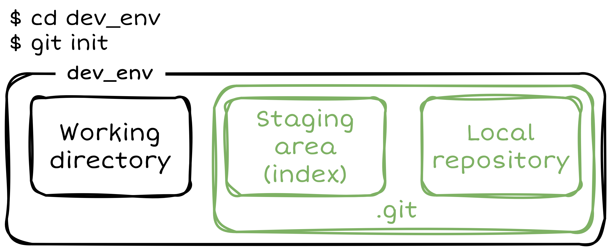
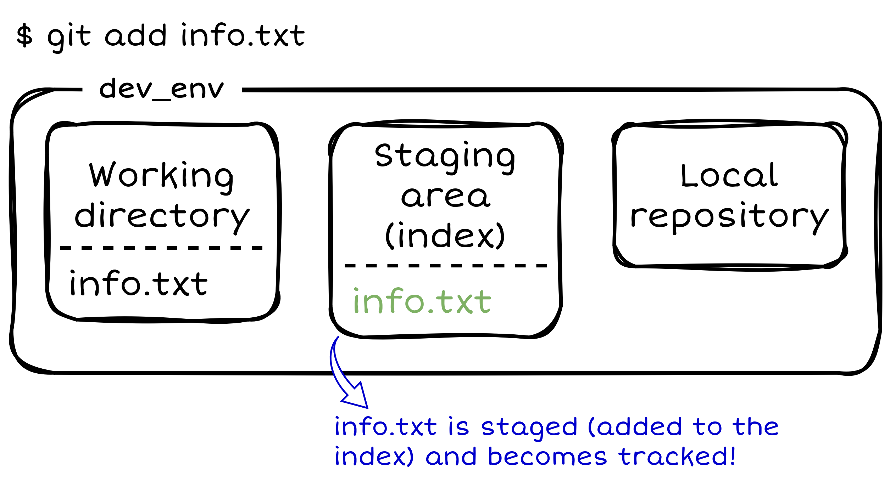
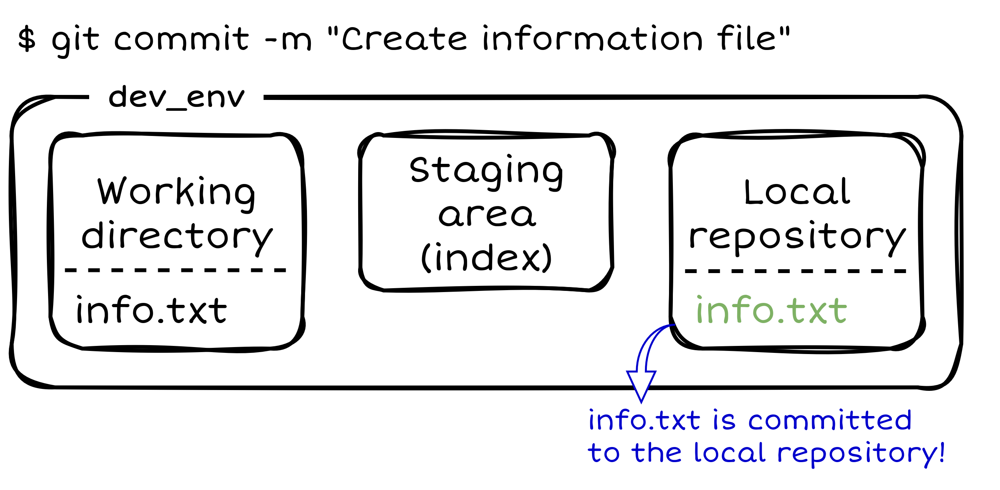
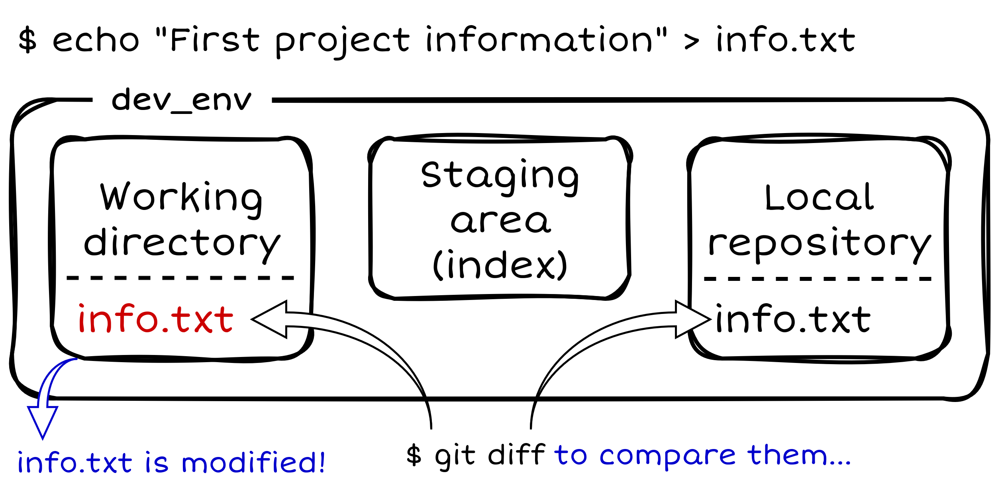
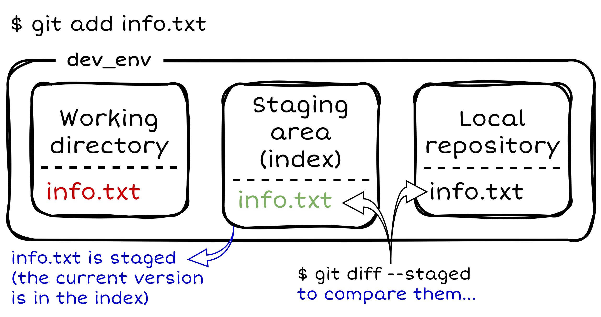

# ПРА: Гит - белешке са вежби

## Зашто постоји систем за верзионисање?

Систем за верзионисање (*Version Control System, VCS*) дозвољава омогућава враћање датотека на пређашње стање, враћање читавог пројекта на пређашње стање, поређење измена током времена, евиденцију о томе ко је последњи изменио нешто што би могло да буде узрок проблема који је настао, ко је објавио да постоји неки проблем и када, и још много тога. У општем случају, употреба VCS-а подразумева и то да ако нешто забрљамо или изгубимо датотеке, лако можемо да их повратимо.

<br>

## Зашто Гит?

Гит спада у дистрибуиране системе за верзионисање (DVCS) где корисници и сарадници на пројекту не преузимају само тренутан изглед датотека, већ потпуно пресликавају цео репозиторијум. Тако да ако неки од сервера са којих је пројекат преузет престане са радом, сваки од корисничких репозиторијума може да се ископира назад на сервер да би се он обновио. Сваки клон је потпуна резервна копија свих података. 

Гит је примарно направљен за потребе развоја Линукс кернела, што значи да је направљен да рукује репозиторијумима са десетинама милиона линија кода од самог почетка. Брзина и перформансе су увек били примарни циљ у току развоја Гита.

<br>

## Зашто GitHub?

Сервис [GitHub](https://github.com/) је највећи хост за Гит репозиторијуме и представља централну тачку сарадње за милионе програмера и пројеката. Велики проценат свих Гит репозиторијума се хостује на сервису GitHub и многи пројекти отвореног кода га користе за Гит хостинг, праћење задатака, преглед кода, и друге ствари. Зато, иако није непосредни део Гит пројекта отвореног кода, постоји велика вероватноћа да ћете у неком тренутку када будете почели професионално да користите програм Гит бити упућени на интеракцију са сервисом GitHub.

<br>

Сада када имамо одговоре на питање *зашто*, хајде да разјаснимо и *како*!

<br>

## Основни материјали и референце за учење

Пре свега је потребно навести одакле можете научити све што ће вам икада требати за Гит. То је [званична страница](https://git-scm.com/) Гит система за верзионисање на којој је целокупни материјал за учење у потпуности и бесплатно доступан! На истој страници у [категорији за учење](https://git-scm.com/learn) наћи ћете следеће материјале:
* [Pro Git](https://git-scm.com/book/en/v2) књига, која је доступна и на српском језику, а такође и у PDF формату за преузимање,
* [Уводни видео материјали](https://git-scm.com/videos),
* [Git Cheat Sheet - брзи водич](https://git-scm.com/cheat-sheet) ([PDF](https://git-scm.com/cheat-sheet.pdf)),
* [Спољни линкови ка додатним материјалима](https://git-scm.com/doc/ext).

Такође је корисно и [упутсво](https://github.com/UnseenWizzard/git_training) које кроз практичан ток тежи да дочара Гит концепте, без фокуса на саме наредбe. 

<br>

## Ресурси и основна подешавања 

Потребно је проверити да ли на вашем систему имате инсталиран `git`. На Линуксу то можемо проверити наредбом:

```
$ git --version
```

Ако на стандардном излазу видите исписану верзију, то значи да већ имате инсталиран `git`, што јесте случај на доста Линукс дистрибуција након самог инсталирања система. Уколико ипак немате, преузмите га користећи [званично упутство](https://git-scm.com/install/linux) (на истој страници се налази и поступак за инсталацију на Виндовс оперативном систему). За потребе овог упутства коришћен је Линукс оперативни систем.

Како бисте имали могућност повезивања удаљених (*remote*) репозиторијума и коришћења SSH протокола, неопходно је да [отворите GitHub налог и подесите SSH приступ](https://git-scm.com/book/en/v2/GitHub-Account-Setup-and-Configuration). Уколико имате потешкоћа у претходно наведеном поступку, обратите се за помоћ ономе ко вас је упутио на читање ових белешки.

Пре почетка коришћења Гита, корисно је "представити се" Гиту именом и имејл адресом. У сврху будућег повезивања удаљених репозиторијума, пожељно је да то буде корисничко име GitHub налога као и имејл адреса са којом је исти повезан, како би будући снимци (комитови) имали адекватно подешеног аутора. Најлакши начин да се то уради је следећим наредбама:

```
$ git config --global user.name "Your Name"
$ git config --global user.email you@yourdomain.example.com
```

Такође, није сувишно поменути ни `help` опцију која је увек доступна из терминала:

```
$ git help
```

Или за нешто дужи списак доступних `git` наредби:

```
$ git help -a
```

док за конкретну `git` наредбу (команду) помоћ и списак доступних опција можете потражити на следећи начин:

```
$ git help <command>
или
$ git <command> --help
```

<br>

## Гит репозиторијум

Рецимо да најпре желимо да направимо развојно окружење `dev_env`. Први корак је прављење истоименог директоријума (нека се налази у `HOME` директоријуму):

```
$ mkdir ~/dev_env
```

<p align="center">
    
</p>

Сада прећи у новонаправљени директоријум наредбом:

```
$ cd ~/dev_env
```

Унутар тренутног радног директоријума (`pra_dev`) извршити наредбу:

```
$ git init
...
Initialized empty Git repository in /home/user/pra_dev/.git/
```

Тиме је тренутни радни директоријум добио димензију локалног Гит репозиторијума, а унутар њега се сада налази `.git` скривени поддиректоријум који ће носити све инфоримације о новонаправљеном Гит репозиторијуму. Као и сви скривени директоријуми, може се излистати наредбом `ls -la`.

Тренутни статус Гит репозиторијума се може добити наредбом `git status`:

```
$ git status
On branch master

No commits yet

nothing to commit (create/copy files and use "git add" to track)
```

Ако се до сада нисте сусрели са Гитом, појмови као што су *branch*, *commit*, *track* су вам вероватно непознати, али идемо редом!

Иницијализацијом Гит репозиторијума наше развојно окружење постаје нешто више од обичног директоријума у датотечном систему. Сада је у оквиру тог директоријума доступна читава ризница `git` наредби која нам омогућава верзионисање његовог садржаја било да су у питању датотеке или поддиректоријуми. Да би се то омогућило, постоји јасно дефинисан поступак чијим праћењем правимо тзв. снимке садржаја репозиторијума. Концептуално, наше развојно окружење сада има следећи изглед:

<p align="center">
    
</p>

У `.git` директоријуму налазе се информације о индексу (*staging area*) и садржају локалног репозиторијума. Видећемо ускоро њихову намену.

<br>

## Додавање и измена садржаја репозиторијума

Сада у нашем окружењу (тренутни радни директоријум) желимо направити нову датотеку `info.txt` у коју намеравамо додавати неке информације:

```
$ touch info.txt
```

<p align="center">
    
</p>

Хајде сада да видимо статус репозиторијума:

```
$ git status
On branch master

No commits yet

Untracked files:
  (use "git add <file>..." to include in what will be committed)
        info.txt

nothing added to commit but untracked files present (use "git add" to track)
```

Видимо да је датотека `info.txt` означена као *untracked* што значи да је Гит "не прати" у окружењу, а самим тим **неће** бити укључена у следећу верзију, односно следећи снимак (*commit*) када се одлучимо да га направимо. Ми желимо супротно тј. да додавање датотеке `info.txt` буде први снимак у нашем репозиторијуму. Да би Гит знао које тачно измене треба снимити, потребно је да му то кажемо додавањем измена у индекс. То можемо урадити наредбом:

```
$ git add info.txt
```

Aко сада проверимо статус репозиторијума:

```
On branch master

No commits yet

Changes to be committed:
  (use "git rm --cached <file>..." to unstage)
        new file:   info.txt
```

Сада за измене (у овом случају додату нову датотеку `info.txt`) кажемо да су додате у индекс или стејџоване (*staged*) и **биће** укључене у наредни снимак, односмо комит, о чему нас статус и обавештава. Такође, ако је у питању нова датотека као у овом случају, додавањем у индекс постаје "праћена" (*tracked*) од стране Гита за будуће измене. Додавање у индекс је илустративно приказано на следећој слици:

<p align="center">
    
</p>

Коначно је време да направимо први снимак у `dev_env` репозиторијуму. У први снимак ће ући све измене које се тренутно налазе у индексу. Користи се следећа наредба:

```
$ git commit -m "Creates information file."
```

Добра је пракса уз сваки снимак оставити одговарајућу поруку, а још боља пракса је да та порука буде смислена и што краће описује измене које су снимљене (комитоване). Више то томе како на што бољи начин писати поруке за снимак можете наћи на [линку](https://chris.beams.io/git-commit).

Пошто су све нове измене (у овом случају додавање `info.txt` датотеке) најпре додате у индекс и затим снимљене, сада поново имамо "чист" Гит статус тј. у репозиторијуму нема нових измена које нису снимљене:

```
$ git status
On branch master
nothing to commit, working tree clean
```

<p align="center">
    
</p>

Сада желимо да додамо и неке конкретне информације у `info.txt` датотеку и са тим изменама поново снимимо садржај репозиторијума. Најпре упишемо неки садржај у `info.txt` датотеку:

```
echo "First Project Information" > info.txt
```

<p align="center">
    
</p>

Исписом статуса видимо да је датотека `info.txt` означена као измењена (*modified*) и да није додата у индекс (*not staged*):

```
$ git status
On branch master
Changes not staged for commit:
  (use "git add <file>..." to update what will be committed)
  (use "git restore <file>..." to discard changes in working directory)
        modified:   info.txt

no changes added to commit (use "git add" and/or "git commit -a")
```

Ако желимо да видимо разлику стања репозиторијума у односу на претходни снимак користимо следећу наредбу:

```diff
$ git diff
diff --git a/info.txt b/info.txt
index e69de29..14ad872 100644
--- a/info.txt
+++ b/info.txt
@@ -0,0 +1 @@
+First Project Information
```

Објашњење исписа `git diff` наредбе:

* `diff --git a/info.txt b/info.txt` - најава да следи поређење за датотеку `info.txt`: `a/` означава "старо" стање, а `b/` "ново" стање.
* `index e69de29..14ad872 100644`:
    * `e69de29` је скраћени идентификатор (хеш) претходног стања датотеке, а овај конкретно означава да је датотека раније била празна.
    * `14ad872` је скраћени хеш новог садржаја датотеке.
    * `100644` је режим дозвола за датотеку, а у овом случају означава да је у питању обична текстуална (неизвршна) датотека.
* `--- a/info.txt` - путања и ознака "старе" датотеке (стање пре измене).
* `+++ b/info.txt` - путања и ознака "нове" датотеке (стање после измене).
* `@@ -0,0 +1 @@` - описује које линије се мењају:
    * `-0,0` значи да стара верзија има 0 линија, тј. датотека је била празна.
    * `+1` значи да нова верзија има једну линију додату (тј. почиње се од линије 1 и мења се 1 линија)
* `+First Project Information` је линија која је додата (префикс `+` значи да се ова линија појављује у новој верзији датотеке, а није била у старој).

Сада треба додати измене у индекс. Пошто је додавање текста `First Project Information` уједно и једина измена која постоји у односу на претходну верзију, није неопходно да специфицирамо назив датотеке, већ можемо искористити опцију `-A` уз наредбу `git add` којом се додају у индекс све измене праћеног садржаја репозиторијума:

```
$ git add -A
или
$ git add info.txt
```

<p align="center">
    
</p>

Статус репозиторијума сада наводи да је измењена датотека `info.txt` сада спремна за снимање тј. налази се у индексу:

```
$ git status
On branch master
Changes to be committed:
  (use "git restore --staged <file>..." to unstage)
        modified:   info.txt
```

Ако желимо видети разлику садржаја индекса у односу на претходни снимак користимо наредбу `git diff --staged`:

```diff
$ git diff --staged
diff --git a/info.txt b/info.txt
index e69de29..14ad872 100644
--- a/info.txt
+++ b/info.txt
@@ -0,0 +1 @@
+First Project Information
```

Сада снимити измене:

```
$ git commit -m "Adds first information."
```

<p align="center">
    
</p>

Списак (историја) досадашњих снимака (комитова), са основним информацијама о њима, може се добити наредбом `git log`:

```
$ git log
commit 872a953cb7bab5265c30ff02e49be49a68803954 (HEAD -> master)
Author: djoto <djordjegacic99tb@gmail.com>
Date:   Sun Jan 25 12:36:50 2026 +0100

    Adds first information.

commit a85068f2419167fc6601b923601998a05491b8ef
Author: djoto <djordjegacic99tb@gmail.com>
Date:   Thu Jan 22 23:04:12 2026 +0100

    Creates information file.
```

Поред имена и имејл адресе аутора, датума и поруке снимка, такође видимо и низ хексадецималних карактера који представљају идентификатор снимка у облику контролне суме ([*checksum*](https://en.wikipedia.org/wiki/Checksum)). Њена улога је да Гиту обезбеди интегритет, тако што се за све рачуна контролна сума пре него што се сачува, а онда се стварима приступа користећи ту контролну суму. То значи да је немогуће променити садржај било које датотеке или директоријума а да Гит не зна за то. Функција коју Гит користи за контролну суму [хеш](https://en.wikipedia.org/wiki/Hash_function) функција [SHA-1](https://en.wikipedia.org/wiki/SHA-1) (*SHA-1 hash*). То је стринг од 40 карактера који се састоји од хексадецималних цифара (0-9 и a-f) и рачуна се на основу садржаја датотека или структуре директоријума. На ту тему можете прочитати [занимљив чланак](https://blog.thoughtram.io/git/2014/11/18/the-anatomy-of-a-git-commit.html) који детаљније пролази кроз поступак стварања хеш вриједности у Гиту. 

Да бисмо сада видели разлику у односу на снимак пре новонаправљеног, користимо наредбу `git diff <commit>^!` којом суштински поредимо два снимка, где је `<commit>` хеш снимка који поредимо, док `^!` је скраћеница која Гиту каже да желимо да упоредимо са снимком непосредно пре оног чији идентификатор проследимо:

```diff
$ git diff 872a953cb7bab5265c30ff02e49be49a68803954^!
diff --git a/info.txt b/info.txt
index e69de29..14ad872 100644
--- a/info.txt
+++ b/info.txt
@@ -0,0 +1 @@
+First Project Information
```

Могуће је видети разлике између било која два снимка у историји, с тим да треба обратити пажњу да хеш новијег снимка иде други по реду јер је синтакса у том случају `git diff <from commit> <to commit>`. Исти резултат као изнад можемо добити и на следећи начин:

```diff
$ git diff a85068f2419167fc6601b923601998a05491b8ef 872a953cb7bab5265c30ff02e49be49a68803954
diff --git a/info.txt b/info.txt
index e69de29..14ad872 100644
--- a/info.txt
+++ b/info.txt
@@ -0,0 +1 @@
+First Project Information
```

Такође, Гит је довољно "паметан" да му није потребан баш читав низ од 40 катактера, већ је исти испис могуће добити и са рецимо првих седам карактера контролне суме (испробати и са мање од седам карактера):

```diff
$ git diff a85068f 872a953
diff --git a/info.txt b/info.txt
index e69de29..14ad872 100644
--- a/info.txt
+++ b/info.txt
@@ -0,0 +1 @@
+First Project Information
```

На исти начин се додају и снимају (под)директоријуми. Рецимо да желимо додати следеће: другу информацију у `info.txt` датотеку, још једну датотеку `deadline.txt` са неким садржајем, и директоријум `tasks` са празним датотекама `task1.txt` и `task2.txt`:

```
echo "Second Project Information" > info.txt
echo "Keep an eye on deadlines!" > deadline.txt
mkdir tasks
touch tasks/task{1,2}.txt
```

Статус репозиторијума је следећи:

```
$ git status
On branch master
Changes not staged for commit:
  (use "git add <file>..." to update what will be committed)
  (use "git restore <file>..." to discard changes in working directory)
        modified:   info.txt

Untracked files:
  (use "git add <file>..." to include in what will be committed)
        deadline.txt
        tasks/

no changes added to commit (use "git add" and/or "git commit -a")
```

Из претходног видимо да Гит препознаје измене у праћеној (*tracked*) `info.txt` датотеци, и препознаје још увек непраћену (*untracked*) датотеку `deadline.txt` и директоријум `tasks` чији је садржај такође непраћен. Међутим, иако постоји, не видимо садржај директоријума `tasks` у овом формату исписа Гит статуса. Да бисмо хијерархијски видели све непраћене датотеке, потребно је исписати статус у другачијем формату, а да бисмо знали у ком потражићемо помоћ наредбом `git status --help` где већ при врху странице налазимо тачно оно што нам треба, а то је коришћење опције `-u`:

```
$ git status --help
...
-u[<mode>], --untracked-files[=<mode>]
    Show untracked files.

    The mode parameter is used to specify the handling of untracked files. It is optional: it defaults to all, and if
    specified, it must be stuck to the option (e.g.  -uno, but not -u no).

    The possible options are:

    •   no - Show no untracked files.

    •   normal - Shows untracked files and directories.

    •   all - Also shows individual files in untracked directories.
...
```

Сада испишемо статус наредбом `git status -u` и добијамо испис непраћених датотека у непраћеном `tasks` директоријуму:

```
$ git status -u
On branch master
Changes not staged for commit:
  (use "git add <file>..." to update what will be committed)
  (use "git restore <file>..." to discard changes in working directory)
        modified:   info.txt

Untracked files:
  (use "git add <file>..." to include in what will be committed)
        deadline.txt
        tasks/task1.txt
        tasks/task2.txt

no changes added to commit (use "git add" and/or "git commit -a")
```

Служећи се `help` исписом, наишли смо на још једну корисну опцију исписа Гит статуса, а то је испис у скраћеном формату коришћењем `-s` опције:

```
$ git status -s
 M info.txt
?? deadline.txt
?? tasks/
```

Са префиксом `M` је означен измењени (*modified*) праћени садржај, док је са `??` означен непраћени садржај. Међутим, поново не видимо хијерархијски датотеке у непраћеном директоријуму `tasks`. Да бисмо их видели и у овом скраћеном формату, користићемо претходно поменуту опцију `-u` заједно са опцијом `-s`:

```
$ git status -su
 M info.txt
?? deadline.txt
?? tasks/task1.txt
?? tasks/task2.txt
```

Одавде смо научили како коришћењем `help` исписа можемо наћи опцију која нам треба, а узгред тражећи једну опцију често пронађемо и још неке за које нисмо ни знали да постоје, а могу бити веома корисне.

Пре прављења новог снимка није на одмет поново проверити разлику у односу на претходни снимак. Пошто су измене у радном директоријуму тј. још нису додате у индекс користимо наредбу `git diff`:

```diff
$ git diff
diff --git a/info.txt b/info.txt
index 14ad872..6a67b63 100644
--- a/info.txt
+++ b/info.txt
@@ -1 +1 @@
-First Project Information
+Second Project Information
```

Најпре видимо да наредба не препознаје непраћени садржај, што је и очекивано, с обзиром да треба да се понаша тако што пореди са неком од већ постојећих снимака у репозиторијуму. Пошто је само датотека `info.txt` праћена, видимо само измене у њој. Наредба `git diff` овде каже да је обрисана (префикс `-`) линија `First Project Information` и уместо ње додата (префикс `+`) линија `Second Project Information`. Међутим, да ли смо то хтели? - Не! Хтели смо само додати `Second Project Information`, а да `First Project Information` остане где је и била. Ако се вратимо назад где смо уписали садржај у `info.txt` датотеку наредбом `echo "Second Project Information" > info.txt` увиђамо да смо направили грешку коришћењем преусмеравања са карактером `>` који прегази постојећи садржај датотеке! Уместо њега је потребно било користити `>>` којим се садржај дода на постојећи. Као што видите, грешке се дешавају, али хајде да из њих нешто научимо! Када не бисмо користили Гит вероватно бисмо отворили датотеку `info.txt` и само додали линију `First Project Information`. Међутим, Гит нам омогућава да праћени садржај вратимо на верзију из претходног снимка уколико приметимо грешку, што значи да не морамо уопште да водимо рачуна о томе шта је била прва линија, већ само вратимо датотеку на претходну верзију и поново извршимо наредбу уписа али на исправан начин. Сложићете се да је такав поступак много мање подложан грешкама него ручно мењање садржаја датотека. То можемо урадити наредбом `git restore <датотека>`:

**Важно:** Пошто `git restore <датотека>` враћа датотеку на претходну верзију, брише се целокупан садржај датотеке који је додат у односу на претходну верзију, и није га могуће вратити, јер није снимљен!

```
$ git restore info.txt
```

Статус сада не исписује да постоје измене у датотеци `info.txt`

```
$ git status -su
?? deadline.txt
?? tasks/task1.txt
?? tasks/task2.txt
```

Исправимо сада грешку и додајмо жељени садржај:

```
$ echo "Second Project Information" >> info.txt
```

```
$ git status -su
 M info.txt
?? deadline.txt
?? tasks/task1.txt
?? tasks/task2.txt
```

```diff
$ git diff
diff --git a/info.txt b/info.txt
index 14ad872..905dc07 100644
--- a/info.txt
+++ b/info.txt
@@ -1 +1,2 @@
 First Project Information
+Second Project Information
```

У испису измена у односу на претходну верзију видимо да сада нема `-` карактер испред прве линије већ само `+` испред друге, што означава да је само додата друга линија, а то смо и хтели да урадимо.

Додајмо сада датотеку `info.txt` у индекс:

```
$ git add info.txt
```
```
$ git status -su
M  info.txt
?? deadline.txt
?? tasks/task1.txt
?? tasks/task2.txt
```

Префикс `M` испред `info.txt` је сада зелене боје што значи да је датотека додата у индекс.

Замислимо да смо грешку видели тек сада тј. након додавања датотеке у индекс. Датотеку би било потребно најпре вратити из индекса, а затим на претходну верзију као и раније, и исправити грешку. За враћање из индекса користи се наредба `git restore --staged <датотека>`:

```
$ git restore --staged info.txt 
```
```
$ git status -su
 M info.txt
?? deadline.txt
?? tasks/task1.txt
?? tasks/task2.txt
```

Сада видимо префикс `M` обојен црвеном бојом што значи да датотека сада није у индексу. Враћање на последњу снимљену верзију би сада ишло наредбом `git restore <датотека>` али то смо већ прошли и није неопходно поново јер је `info.txt` сада у реду. Додајмо датотеку `info.txt` поново у индекс и снимимо њене измене. Могуће је директно снимити све измене **праћеног** садржаја без засебног додавања истих у индекс (без експлицитног позивања `git add` наредбе) додавањем опције `-a` уз `git commit` наредбу. Једини праћени садржаја који у нашем случају има измене је `info.txt` датотека, па ову опцију можемо искористити за снимање њиних измена у репозиторијм.

```
$ git commit -a -m "Adds second information."
[master 8141c56] Adds second information.
 1 file changed, 1 insertion(+)
```

```
$ git log
commit 8141c56b127e0fe0bec2f475a57c2506d44f2155 (HEAD -> master)
Author: djoto <djordjegacic99tb@gmail.com>
Date:   Mon Jan 26 18:34:21 2026 +0100

    Adds second information.

commit 872a953cb7bab5265c30ff02e49be49a68803954
Author: djoto <djordjegacic99tb@gmail.com>
Date:   Sun Jan 25 12:36:50 2026 +0100

    Adds first information.

commit a85068f2419167fc6601b923601998a05491b8ef
Author: djoto <djordjegacic99tb@gmail.com>
Date:   Thu Jan 22 23:04:12 2026 +0100

    Creates information file.
```

```
$ git status -su
?? deadline.txt
?? tasks/task1.txt
?? tasks/task2.txt
```

Додајмо сада све остале промене у индекс (сада **не** можемо избећи експлицитно позивање `git add` наредбе опцијом `-a` уз `git commit` наредбу јер се не ради о садржају који је праћен и Гит од раније не зна ништа о њему):

```
$ git add -A
```
```
$ git status -su
A  deadline.txt
A  tasks/task1.txt
A  tasks/task2.txt
```

Зелени префикси `А` означавају да су датотеке (које нису биле праћене) додате у индекс и тиме је Гит почео да их прати.

Снимимо сада промене додате у индекс, са одговарајућом поруком:

```
$ git commit -m "Adds deadline file and two tasks."
[master d87e1fc] Adds deadline file and two tasks.
 3 files changed, 1 insertion(+)
 create mode 100644 deadline.txt
 create mode 100644 tasks/task1.txt
 create mode 100644 tasks/task2.txt
```

Као што видимо након снимања, на стандардном излазу добијемо кратак извештај о изменама које су снимљене.

Историју снимака можемо исписати у различитим форматима. Рецимо за скраћени формат користимо `--oneline` опцију са `git log` наредбом:

```
$ git log --oneline
d87e1fc (HEAD -> master) Adds deadline file and two tasks.
8141c56 Adds second information.
872a953 Adds first information.
a85068f Creates information file.
```

Само последњи снимак можемо излистати опцијом `-1`, последња два опцијом `-2` итд:

```
$ git log -1
commit d87e1fcef42babbbfed06767b0e2a14b15a444aa (HEAD -> master)
Author: djoto <djordjegacic99tb@gmail.com>
Date:   Mon Jan 26 18:42:26 2026 +0100

    Adds deadline file and two tasks.
```

Или ако желимо излистати и датотеке које су измењене/додате у одређеном снимку користимо `--name-only` опцију:

```
$ git log --name-only
commit d87e1fcef42babbbfed06767b0e2a14b15a444aa (HEAD -> master)
Author: djoto <djordjegacic99tb@gmail.com>
Date:   Mon Jan 26 18:42:26 2026 +0100

    Adds deadline file and two tasks.

deadline.txt
tasks/task1.txt
tasks/task2.txt

commit 8141c56b127e0fe0bec2f475a57c2506d44f2155
Author: djoto <djordjegacic99tb@gmail.com>
Date:   Mon Jan 26 18:34:21 2026 +0100

    Adds second information.

info.txt

commit 872a953cb7bab5265c30ff02e49be49a68803954
Author: djoto <djordjegacic99tb@gmail.com>
Date:   Sun Jan 25 12:36:50 2026 +0100

    Adds first information.

info.txt

commit a85068f2419167fc6601b923601998a05491b8ef
Author: djoto <djordjegacic99tb@gmail.com>
Date:   Thu Jan 22 23:04:12 2026 +0100

    Creates information file.

info.txt
```

Ако желимо излистати снимке у којима се мењала/додавала одређена датотека (рецимо `deadline.txt`):

```
$ git log -- deadline.txt
commit d87e1fcef42babbbfed06767b0e2a14b15a444aa (HEAD -> master)
Author: djoto <djordjegacic99tb@gmail.com>
Date:   Mon Jan 26 18:42:26 2026 +0100

    Adds deadline file and two tasks.
```

Опције се наравно могу и комбиновати, тако да ако желимо само последњи снимак у скраћеном формату, али да видимо и датотеке које су измењене/додате у том снимку користимо следећу наредбу:

```
$ git log -1 --oneline --name-only
d87e1fc (HEAD -> master) Adds deadline file and two tasks.
deadline.txt
tasks/task1.txt
tasks/task2.txt
```

Могуће је излистати историју снимака тако да исписује и детаље о изменама у сваком снимку, а то се постиже коришћењем опције `-p` (или `--patch`). Рецимо да желимо на тај начин исписати последња два снимка из историје:

```diff
$ git log -p -2
commit d87e1fcef42babbbfed06767b0e2a14b15a444aa (HEAD -> master)
Author: djoto <djordjegacic99tb@gmail.com>
Date:   Mon Jan 26 18:42:26 2026 +0100

    Adds deadline file and two tasks.

diff --git a/deadline.txt b/deadline.txt
new file mode 100644
index 0000000..57895ac
--- /dev/null
+++ b/deadline.txt
@@ -0,0 +1 @@
+Keep an eye on deadlines!
diff --git a/tasks/task1.txt b/tasks/task1.txt
new file mode 100644
index 0000000..e69de29
diff --git a/tasks/task2.txt b/tasks/task2.txt
new file mode 100644
index 0000000..e69de29

commit 8141c56b127e0fe0bec2f475a57c2506d44f2155
Author: djoto <djordjegacic99tb@gmail.com>
Date:   Mon Jan 26 18:34:21 2026 +0100

    Adds second information.

diff --git a/info.txt b/info.txt
index 14ad872..905dc07 100644
--- a/info.txt
+++ b/info.txt
@@ -1 +1,2 @@
 First Project Information
+Second Project Information
```

<br>

## Гранање
