# ПРА: Гит - белешке са вежби

## Садржај

- [Зашто постоји систем за верзионисање?](#зашто-постоји-систем-за-верзионисање)
- [Зашто Гит?](#зашто-гит)
- [Зашто GitHub?](#зашто-github)
- [Основни материјали и референце за учење](#основни-материјали-и-референце-за-учење)
- [Ресурси и основна подешавања](#ресурси-и-основна-подешавања)
- [Прављење Гит репозиторијума](#прављење-гит-репозиторијума)
- [Додавање и комитовање измена над репозиторијумом](#додавање-и-комитовање-измена-над-репозиторијумом)
  - [Додавање измена у индекс](#додавање-измена-у-индекс)
  - [Комитовање (снимање) измена](#комитовање-снимање-измена)
  - [Испис разлика у односу на претходне комитове](#испис-разлика-у-односу-на-претходне-комитове)
  - [Испис историје комитова](#испис-историје-комитова)
  - [Испис разлике између комитова у историји](#испис-разлике-између-комитова-у-историји)
  - [Формати исписа статуса репозиторијума](#формати-исписа-статуса-репозиторијума)
  - [Враћање на стање претходног комита](#враћање-на-стање-претходног-комита)
  - [Директно комитовање без експлицитног додавања у индекс](#директно-комитовање-без-експлицитног-додавања-у-индекс)
  - [Формати исписа историје комитова](#формати-исписа-историје-комитова)
  - [Опозив комита](#опозив-комита)
  - [Приказ детаља тачно одређеног комита](#приказ-детаља-тачно-одређеног-комита)
- [Означавање (таговање)](#означавање-таговање)
- [Гит објекти и структура репозиторијума](#гит-објекти-и-структура-репозиторијума)
- [Гранање](#гранање)
  - [Прављење нове гране](#прављење-нове-гране)
  - [Пребацивање између грана](#пребацивање-између-грана)
  - [Спајање грана](#спајање-грана)
  - [Брисање гране](#брисање-гране)
  - [Ребазирање грана](#ребазирање-грана)
    - [Испис разлика између више грана](#испис-разлика-између-више-грана)
    - [Конфликти](#конфликти)
- [Рад са удаљеним репозиторијумима](#рад-са-удаљеним-репозиторијумима)
  - [Приказ удаљених репозиторијума](#приказ-удаљених-репозиторијума)
  - [Прављење GitHub репозиторијума](#прављење-github-репозиторијума)
  - [Додавање удаљених репозиторијума](#додавање-удаљених-репозиторијума)
  - [Слање на удаљени репозиторијум](#слање-на-удаљени-репозиторијум)
  - [Добављање и повлачење из удаљених репозиторијума](#добављање-и-повлачење-из-удаљених-репозиторијума)
  - [Скривање](#скривање)
  - [Клонирање удаљеног репозиторијума](#клонирање-удаљеног-репозиторијума)
- [Гит алијаси](#гит-алијаси)
- [Игнорисање датотека](#игнорисање-датотека)

<br>

## Зашто постоји систем за верзионисање?

Систем за верзионисање (*Version Control System, VCS*) омогућава враћање датотека на пређашње стање, враћање читавог пројекта на пређашње стање, поређење измена током времена, евиденцију о томе ко је последњи изменио нешто што би могло да буде узрок проблема који је настао, ко је објавио да постоји неки проблем и када, [и још много тога](https://stackoverflow.com/questions/1408450/why-should-i-use-version-control/1408464#1408464). У општем случају, употреба VCS-а подразумева и то да ако нешто забрљамо или изгубимо датотеке, лако можемо да их повратимо.

<br>

## Зашто Гит?

Гит спада у дистрибуиране системе за верзионисање (DVCS) где корисници и сарадници на пројекту не преузимају само тренутан изглед датотека, већ потпуно пресликавају цео репозиторијум. Тако да ако неки од сервера са којих је пројекат преузет престане са радом, сваки од корисничких репозиторијума може да се ископира назад на сервер да би се он обновио. Сваки клон је потпуна резервна копија свих података. 

Гит је примарно направљен за потребе развоја Линукс кернела, што значи да је направљен да рукује репозиторијумима са десетинама милиона линија кода од самог почетка. Брзина и перформансе су увек били примарни циљ у току развоја Гита.

<br>

## Зашто GitHub?

Сервис [GitHub](https://github.com/) је највећи хост за Гит репозиторијуме и представља централну тачку сарадње за милионе програмера и пројеката. Велики проценат свих Гит репозиторијума се хостује на сервису GitHub и многи пројекти отвореног кода га користе за Гит хостинг, праћење задатака, преглед кода, и друге ствари. Зато, иако није непосредни део Гит пројекта отвореног кода, постоји велика вероватноћа да ћете у неком тренутку када будете почели професионално да користите програм Гит бити упућени на интеракцију са сервисом GitHub.

<br>

Сада када имамо одговоре на питање *зашто*, хајде да разјаснимо и *како*!

<br>

## Основни материјали и референце за учење

Пре свега је потребно навести одакле можете научити све што ће вам икада требати за Гит. То је [званична страница](https://git-scm.com/) Гит система за верзионисање на којој је целокупни материјал за учење у потпуности и бесплатно доступан! На истој страници у [категорији за учење](https://git-scm.com/learn) наћи ћете следеће материјале:
* [Pro Git](https://git-scm.com/book/en/v2) књига, која је доступна и на српском језику, а такође и у PDF формату за преузимање,
* [Уводни видео материјали](https://git-scm.com/videos),
* [Git Cheat Sheet - брзи водич](https://git-scm.com/cheat-sheet) ([PDF](https://git-scm.com/cheat-sheet.pdf)),
* [Спољни линкови ка додатним материјалима](https://git-scm.com/doc/ext).

Такође је корисно и [упутство](https://github.com/UnseenWizzard/git_training) које тежи да дочара Гит концепте, без претереног фокуса на конкретне наредбe. 

<br>

## Ресурси и основна подешавања 

Потребно је проверити да ли на вашем систему имате инсталиран `git`. На Линуксу то можемо проверити наредбом:

```
$ git --version
git version 2.52.0
```

Видимо да је у тренутку писања ових белешки инсталирана верзија `2.52.0`. Ако на стандардном излазу видите исписану верзију, то значи да већ имате инсталиран `git`, што јесте случај на доста Линукс дистрибуција након самог инсталирања система. Уколико ипак немате, преузмите га користећи [званично упутство](https://git-scm.com/install/linux) (на истој страници се налази и поступак за инсталацију на Виндовс оперативном систему). За потребе овог упутства коришћен је Линукс оперативни систем.

Како бисте имали могућност повезивања удаљених (*remote*) репозиторијума и коришћења SSH протокола, неопходно је да [отворите GitHub налог и подесите SSH приступ](https://git-scm.com/book/en/v2/GitHub-Account-Setup-and-Configuration). Уколико имате потешкоћа у претходно наведеном поступку, обратите се за помоћ ономе ко вас је упутио на читање ових белешки.

Пре почетка коришћења Гита, корисно је "представити се" Гиту именом и имејл адресом. У сврху будућег повезивања удаљених репозиторијума, пожељно је да то буде корисничко име GitHub налога као и имејл адреса са којом је исти повезан, како би будући снимци (комитови) имали адекватно подешеног аутора. Најлакши начин да се то уради је следећим наредбама:

```
$ git config --global user.name "user"
$ git config --global user.email you@yourdomain.example.com
```

Такође, није сувишно поменути ни `help` опцију која је увек доступна из терминала:

```
$ git help
```

Или за нешто дужи списак доступних `git` наредби:

```
$ git help -a
```

док за конкретну `git` наредбу (команду) помоћ и списак доступних опција можете потражити на следећи начин:

```
$ git help <command>
или
$ git <command> --help
```

<br>

## Прављење Гит репозиторијума

Рецимо да најпре желимо да направимо развојно окружење `dev_env`. Први корак је прављење истоименог директоријума (нека се налази у `HOME` директоријуму):

```
$ mkdir ~/dev_env
```

<p align="center">
    
</p>

Сада прећи у новонаправљени директоријум наредбом:

```
$ cd ~/dev_env
```

Унутар тренутног радног директоријума (`pra_dev`) извршити наредбу:

```
$ git init
...
Initialized empty Git repository in /home/user/pra_dev/.git/
```

Тиме је тренутни радни директоријум добио димензију локалног Гит репозиторијума, а унутар њега се сада налази `.git` скривени поддиректоријум који ће носити све инфоримације о новонаправљеном Гит репозиторијуму. Као и сви скривени директоријуми, може се излистати наредбом `ls -la`.

Тренутни статус Гит репозиторијума се може добити наредбом `git status`:

```
$ git status
On branch master

No commits yet

nothing to commit (create/copy files and use "git add" to track)
```

Ако се до сада нисте сусрели са Гитом, појмови као што су *branch*, *commit*, *track* су вам вероватно непознати, али идемо редом!

Иницијализацијом Гит репозиторијума наше развојно окружење постаје нешто више од обичног директоријума у датотечном систему. Сада је у оквиру тог директоријума доступна читава ризница `git` наредби која нам омогућава верзионисање његовог садржаја било да су у питању датотеке или поддиректоријуми. Да би се то омогућило, постоји јасно дефинисан поступак чијим праћењем правимо тзв. снимке (*snapshots*) садржаја репозиторијума. Концептуално, наше развојно окружење сада има следећи изглед:

<p align="center">
    
</p>

У `.git` директоријуму налазе се информације о индексу (*staging area*) и садржају локалног репозиторијума. Видећемо ускоро њихову намену.

<br>

## Додавање и комитовање измена над репозиторијумом

Сада у нашем окружењу (тренутни радни директоријум) желимо направити нову датотеку `info.txt` у коју намеравамо додавати неке информације:

```
$ touch info.txt
```

<p align="center">
    
</p>

<br>

### Додавање измена у индекс

Хајде сада да видимо статус репозиторијума:

```
$ git status
On branch master

No commits yet

Untracked files:
  (use "git add <file>..." to include in what will be committed)
        info.txt

nothing added to commit but untracked files present (use "git add" to track)
```

Видимо да је датотека `info.txt` означена као *untracked* што значи да је Гит "не прати" у окружењу, а самим тим **неће** бити укључена у следећу верзију, односно снимак следећег комита (*commit*), када се одлучимо да га направимо. Ми желимо супротно тј. да додавање датотеке `info.txt` буде први комит у нашем репозиторијуму. Да би Гит знао које тачно измене треба снимити, потребно је да му то кажемо додавањем измена у индекс. То можемо урадити наредбом:

```
$ git add info.txt
```

Aко сада проверимо статус репозиторијума:

```
$ git status
On branch master

No commits yet

Changes to be committed:
  (use "git rm --cached <file>..." to unstage)
        new file:   info.txt
```

Сада за измене (у овом случају додату нову датотеку `info.txt`) кажемо да су додате у индекс или стејџоване (*staged*) и **биће** укључене у наредни комит, о чему нас статус и обавештава. Такође, ако је у питању нова датотека као у овом случају, додавањем у индекс постаје "праћена" (*tracked*) од стране Гита за будуће измене. Додавање у индекс је илустративно приказано на следећој слици:

<p align="center">
    
</p>

<br>

### Комитовање (снимање) измена 

Коначно је време да направимо први комит у `dev_env` репозиторијуму. У први комит ће ући све измене које се тренутно налазе у индексу. Користи се следећа наредба:

```
$ git commit -m "Creates information file."
```

Добра је пракса уз сваки комит оставити одговарајућу поруку, а још боља пракса је да та порука буде смислена и што краће описује измене које су комитоване (снимљене). Више то томе како на што бољи начин писати комит поруке можете наћи на [линку](https://chris.beams.io/git-commit).

Пошто су све нове измене (у овом случају додавање `info.txt` датотеке) најпре додате у индекс и затим комитоване, сада поново имамо "чист" Гит статус тј. у репозиторијуму нема нових измена, односно измена које нису комитоване:

```
$ git status
On branch master
nothing to commit, working tree clean
```

<p align="center">
    
</p>

Сада желимо да додамо и неке конкретне информације у `info.txt` датотеку и са тим изменама поново комитујемо. Најпре упишемо неки садржај у `info.txt` датотеку:

```
echo "First Project Information" > info.txt
```

<p align="center">
    
</p>

Исписом статуса видимо да је датотека `info.txt` означена као измењена (*modified*) и да није додата у индекс (*not staged*):

```
$ git status
On branch master
Changes not staged for commit:
  (use "git add <file>..." to update what will be committed)
  (use "git restore <file>..." to discard changes in working directory)
        modified:   info.txt

no changes added to commit (use "git add" and/or "git commit -a")
```

<br>

### Испис разлика у односу на претходне комитове

Ако желимо да видимо разлику стања репозиторијума у односу на претходни комит користимо следећу наредбу:

```diff
$ git diff
diff --git a/info.txt b/info.txt
index e69de29..14ad872 100644
--- a/info.txt
+++ b/info.txt
@@ -0,0 +1 @@
+First Project Information
```

Објашњење исписа `git diff` наредбе:

* `diff --git a/info.txt b/info.txt` - најава да следи поређење за датотеку `info.txt`: `a/` означава "старо" стање, а `b/` "ново" стање.
* `index e69de29..14ad872 100644`:
    * `e69de29` је скраћени идентификатор (хеш) претходног стања датотеке, а овај конкретно означава да је датотека раније била празна.
    * `14ad872` је скраћени хеш новог садржаја датотеке.
    * `100644` је режим дозвола за датотеку, а у овом случају означава да је у питању обична текстуална (неизвршна) датотека.
* `--- a/info.txt` - путања и ознака "старе" датотеке (стање пре измене).
* `+++ b/info.txt` - путања и ознака "нове" датотеке (стање после измене).
* `@@ -0,0 +1 @@` - описује које линије се мењају:
    * `-0,0` значи да стара верзија има 0 линија, тј. датотека је била празна.
    * `+1` значи да нова верзија има једну линију додату (тј. почиње се од линије 1 и мења се 1 линија)
* `+First Project Information` је линија која је додата (префикс `+` значи да се ова линија појављује у новој верзији датотеке, а није била у старој).

Сада треба додати измене у индекс. Пошто је додавање текста `First Project Information` уједно и једина измена која постоји у односу на претходну верзију, није неопходно да специфицирамо назив датотеке, већ можемо искористити опцију `-A` уз наредбу `git add` којом се додају у индекс све измене праћеног садржаја репозиторијума:

```
$ git add -A
```

<p align="center">
    
</p>

Статус репозиторијума сада наводи да је измењена датотека `info.txt` сада спремна за комитовање тј. налази се у индексу:

```
$ git status
On branch master
Changes to be committed:
  (use "git restore --staged <file>..." to unstage)
        modified:   info.txt
```

Ако желимо видети разлику **садржаја индекса** у односу на претходни комит користимо наредбу `git diff --staged`:

```diff
$ git diff --staged
diff --git a/info.txt b/info.txt
index e69de29..14ad872 100644
--- a/info.txt
+++ b/info.txt
@@ -0,0 +1 @@
+First Project Information
```

Сада комитовати измене:

```
$ git commit -m "Adds first information."
```

<p align="center">
    
</p>

<br>

### Испис историје комитова

Списак (историја) досадашњих комитова, са основним информацијама о њима, може се добити наредбом `git log`:

```
$ git log
commit eea05dfb4ac0e06317a3a47f89e9cac44ed1b741 (HEAD -> master)
Author: user <you@yourdomain.example.com>
Date:   Wed Jan 28 21:04:00 2026 +0100

    Adds first information.

commit 584a0e40dcfc5eb243dc2735916f2372164f459d
Author: user <you@yourdomain.example.com>
Date:   Wed Jan 28 21:02:09 2026 +0100

    Creates information file.
```

Поред имена и имејл адресе аутора, датума и поруке комита, такође видимо и низ хексадецималних карактера који представљају идентификатор комита у облику контролне суме ([*checksum*](https://en.wikipedia.org/wiki/Checksum)). Њена улога је да Гиту обезбеди интегритет, тако што се за све рачуна контролна сума пре него што се сачува, а онда се стварима приступа користећи ту контролну суму. То значи да је немогуће променити садржај било које датотеке или директоријума а да Гит не зна за то. Функција коју Гит користи за контролну суму [хеш](https://en.wikipedia.org/wiki/Hash_function) функција [SHA-1](https://en.wikipedia.org/wiki/SHA-1) (*SHA-1 hash*). То је стринг од 40 карактера који се састоји од хексадецималних цифара (0-9 и a-f) и рачуна се на основу садржаја датотека или структуре директоријума. На ту тему можете прочитати [занимљив чланак](https://blog.thoughtram.io/git/2014/11/18/the-anatomy-of-a-git-commit.html) који детаљније пролази кроз поступак стварања хеш вриједности у Гиту. 

<br>

### Испис разлике између комитова у историји

Да бисмо сада видели разлику у односу на комит пре новонаправљеног, користимо наредбу `git diff <commit>^!` којом суштински поредимо два комита, где је `<commit>` хеш комита који поредимо, док је `^!` скраћеница која Гиту каже да желимо да упоредимо са комитом непосредно пре оног чији идентификатор проследимо:

```diff
$ git diff eea05dfb4ac0e06317a3a47f89e9cac44ed1b741^!
diff --git a/info.txt b/info.txt
index e69de29..14ad872 100644
--- a/info.txt
+++ b/info.txt
@@ -0,0 +1 @@
+First Project Information
```

Могуће је видети разлике између било која два комита у историји, с тим да треба обратити пажњу да хеш новијег комита иде други по реду јер је синтакса у том случају `git diff <from commit> <to commit>`. Исти резултат као изнад можемо добити и на следећи начин:

```diff
$ git diff 584a0e40dcfc5eb243dc2735916f2372164f459d  eea05dfb4ac0e06317a3a47f89e9cac44ed1b741
diff --git a/info.txt b/info.txt
index e69de29..14ad872 100644
--- a/info.txt
+++ b/info.txt
@@ -0,0 +1 @@
+First Project Information
```

Такође, Гит је довољно "паметан" да му није потребан баш читав низ од 40 карактера, већ је исти испис могуће добити и са рецимо првих седам карактера контролне суме (испробати и са мање од седам карактера):

```diff
$ git diff 584a0e4 eea05dfdiff --git a/info.txt b/info.txt
index e69de29..14ad872 100644
--- a/info.txt
+++ b/info.txt
@@ -0,0 +1 @@
+First Project Information
```

<br>

### Формати исписа статуса репозиторијума

На исти начин се додају и комитују (под)директоријуми. Рецимо да желимо додати следеће: другу информацију у `info.txt` датотеку, још једну датотеку `deadline.txt` са неким садржајем, и директоријум `tasks` са датотекама `task1.txt` и `task2.txt`:

```
$ echo "Second Project Information" > info.txt
$ echo "Keep an eye on deadlines!" > deadline.txt
$ mkdir tasks
$ touch tasks/task{1,2}.txt
```

Статус репозиторијума је следећи:

```
$ git status
On branch master
Changes not staged for commit:
  (use "git add <file>..." to update what will be committed)
  (use "git restore <file>..." to discard changes in working directory)
        modified:   info.txt

Untracked files:
  (use "git add <file>..." to include in what will be committed)
        deadline.txt
        tasks/

no changes added to commit (use "git add" and/or "git commit -a")
```

Из претходног видимо да Гит препознаје измене у праћеној (*tracked*) `info.txt` датотеци, и препознаје још увек непраћену (*untracked*) датотеку `deadline.txt` и директоријум `tasks` чији је садржај такође непраћен. Међутим, иако постоји, не видимо садржај директоријума `tasks` у овом формату исписа Гит статуса. Да бисмо хијерархијски видели све непраћене датотеке, потребно је исписати статус у другачијем формату, а да бисмо знали у ком потражићемо помоћ наредбом `git status --help` где већ при врху странице налазимо тачно оно што нам треба, а то је коришћење опције `-u`:

```
$ git status --help
...
-u[<mode>], --untracked-files[=<mode>]
    Show untracked files.

    The mode parameter is used to specify the handling of untracked files. It is optional: it defaults to all, and if
    specified, it must be stuck to the option (e.g.  -uno, but not -u no).

    The possible options are:

    •   no - Show no untracked files.

    •   normal - Shows untracked files and directories.

    •   all - Also shows individual files in untracked directories.
...
```

Сада испишемо статус наредбом `git status -u` и добијамо испис непраћених датотека у непраћеном `tasks` директоријуму:

```
$ git status -u
On branch master
Changes not staged for commit:
  (use "git add <file>..." to update what will be committed)
  (use "git restore <file>..." to discard changes in working directory)
        modified:   info.txt

Untracked files:
  (use "git add <file>..." to include in what will be committed)
        deadline.txt
        tasks/task1.txt
        tasks/task2.txt

no changes added to commit (use "git add" and/or "git commit -a")
```

Служећи се `help` исписом, наишли смо на још једну корисну опцију исписа Гит статуса, а то је испис у скраћеном формату коришћењем `-s` опције:

```
$ git status -s
 M info.txt
?? deadline.txt
?? tasks/
```

Са префиксом `M` је означен измењени (*modified*) праћени садржај, док је са `??` означен непраћени садржај. Међутим, поново не видимо хијерархијски датотеке у непраћеном директоријуму `tasks`. Да бисмо их видели и у овом скраћеном формату, користићемо претходно поменуту опцију `-u` заједно са опцијом `-s`:

```
$ git status -su
 M info.txt
?? deadline.txt
?? tasks/task1.txt
?? tasks/task2.txt
```

Одавде смо научили како коришћењем `help` исписа можемо наћи опцију која нам треба, а узгред тражећи једну опцију често пронађемо и још неке за које нисмо ни знали да постоје, а могу бити веома корисне.

<br>

### Враћање на стање претходног комита

Пре прављења новог комита није на одмет поново проверити разлику у односу на претходни комит. Пошто су измене сада у радном директоријуму тј. још увек нису додате у индекс користимо наредбу `git diff`:

```diff
$ git diff
diff --git a/info.txt b/info.txt
index 14ad872..6a67b63 100644
--- a/info.txt
+++ b/info.txt
@@ -1 +1 @@
-First Project Information
+Second Project Information
```

Најпре видимо да наредба не препознаје непраћени садржај, што је и очекивано, с обзиром да треба да се понаша тако што пореди са неком од већ постојећих комитова у репозиторијуму. Пошто је само датотека `info.txt` праћена, видимо само измене у њој. Наредба `git diff` овде каже да је обрисана (префикс `-`) линија `First Project Information` и уместо ње додата (префикс `+`) линија `Second Project Information`. Међутим, да ли смо то хтели? - Не! Хтели смо само додати `Second Project Information`, а да `First Project Information` остане где је и била. Ако се вратимо назад где смо уписали садржај у `info.txt` датотеку наредбом `echo "Second Project Information" > info.txt` увиђамо да смо направили грешку коришћењем преусмеравања са карактером `>` који прегази постојећи садржај датотеке! Уместо њега је потребно било користити `>>` којим се садржај дода на постојећи. Као што видите, грешке се дешавају, али хајде да из њих нешто научимо! Када не бисмо користили Гит вероватно бисмо отворили датотеку `info.txt` и само додали линију `First Project Information`. Међутим, Гит нам омогућава да праћени садржај вратимо на верзију из претходног комита уколико приметимо грешку, што значи да не морамо уопште да водимо рачуна о томе шта је била прва линија, већ само вратимо датотеку на претходну верзију и поново извршимо наредбу уписа али на исправан начин. Сложићете се да је такав поступак много мање подложан грешкама него ручно мењање садржаја датотека! То можемо урадити наредбом `git restore <датотека>`:

**Важно:** Пошто `git restore <датотека>` враћа датотеку на претходну верзију, брише се целокупан садржај датотеке који је додат у односу на претходну верзију, и није га могуће вратити, јер **није** комитован!

```
$ git restore info.txt
```

Статус сада не исписује да постоје измене у датотеци `info.txt`

```
$ git status -su
?? deadline.txt
?? tasks/task1.txt
?? tasks/task2.txt
```

P.S. Могуће је вратити стање датотеке на било који комит у историји наредбом:

```
git checkout <commit> -- <file_name>
```

Исправимо сада грешку и додајмо жељени садржај:

```
$ echo "Second Project Information" >> info.txt
```

```
$ git status -su
 M info.txt
?? deadline.txt
?? tasks/task1.txt
?? tasks/task2.txt
```

```diff
$ git diff
diff --git a/info.txt b/info.txt
index 14ad872..905dc07 100644
--- a/info.txt
+++ b/info.txt
@@ -1 +1,2 @@
 First Project Information
+Second Project Information
```

У испису измена у односу на претходну верзију видимо да сада нема `-` карактер испред прве линије већ само `+` испред друге, што означава да је само додата друга линија, а то смо и хтели да урадимо.

Додајмо сада датотеку `info.txt` у индекс:

```
$ git add info.txt
```
```
$ git status -su
M  info.txt
?? deadline.txt
?? tasks/task1.txt
?? tasks/task2.txt
```

Префикс `M` испред `info.txt` је сада зелене боје што значи да је датотека додата у индекс.

Замислимо да смо грешку видели тек сада тј. након додавања датотеке у индекс. Датотеку би било потребно најпре вратити из индекса, а затим на претходну верзију као и раније, и исправити грешку. За враћање из индекса користи се наредба `git restore --staged <датотека>`:

```
$ git restore --staged info.txt 
```
```
$ git status -su
 M info.txt
?? deadline.txt
?? tasks/task1.txt
?? tasks/task2.txt
```

Сада видимо префикс `M` обојен црвеном бојом што значи да датотека сада није у индексу. Враћање на последњу снимљену верзију би сада ишло наредбом `git restore <датотека>` али то смо већ прошли и није неопходно поново јер је `info.txt` сада у реду. Додајмо датотеку `info.txt` поново у индекс и комитујемо измене. 

P.S. Враћање радног директоријума на стање неког од претходних комитова могуће је извршити наредбом:

```
$ git checkout <commit>
```

<br>

### Директно комитовање без експлицитног додавања у индекс

Могуће је директно комитовати све измене **праћеног** садржаја без експлицитног додавања истих у индекс (без експлицитног позивања `git add` наредбе) додавањем опције `-a` уз `git commit` наредбу. Једини праћени садржаја који у нашем случају има измене је `info.txt` датотека, па ову опцију можемо искористити за комитовање њених измена у репозиторијм.

```
$ git commit -a -m "Adds second information."
```

```
$ git log
commit bd597e2c2fc7aafc84e8322bad54a7241b8abb02 (HEAD -> master)
Author: user <you@yourdomain.example.com>
Date:   Wed Jan 28 21:10:53 2026 +0100

    Adds second information.

commit eea05dfb4ac0e06317a3a47f89e9cac44ed1b741
Author: user <you@yourdomain.example.com>
Date:   Wed Jan 28 21:04:00 2026 +0100

    Adds first information.

commit 584a0e40dcfc5eb243dc2735916f2372164f459d
Author: user <you@yourdomain.example.com>
Date:   Wed Jan 28 21:02:09 2026 +0100

    Creates information file.
```

```
$ git status -su
?? deadline.txt
?? tasks/task1.txt
?? tasks/task2.txt
```

Додајмо сада све остале промене у индекс (сада **не** можемо избећи експлицитно позивање `git add` наредбе опцијом `-a` уз `git commit` наредбу јер се ради о садржају који **није** праћен и Гит од раније не зна ништа о њему):

```
$ git add -A
```
```
$ git status -su
A  deadline.txt
A  tasks/task1.txt
A  tasks/task2.txt
```

Зелени префикси `А` означавају да су датотеке (које нису биле праћене) додате у индекс и тиме је Гит почео да их прати.

Комитујмо сада промене додате у индекс, са одговарајућом поруком:

```
$ git commit -m "Adds deadline file and two tasks."
```

<br>

### Формати исписа историје комитова

Историју комитова можемо исписати у различитим форматима. Рецимо за скраћени формат користимо `--oneline` опцију са `git log` наредбом:

```
$ git log --oneline
a1f8a55 (HEAD -> master) Adds deadline file and two tasks.
bd597e2 Adds second information.
eea05df Adds first information.
584a0e4 Creates information file.
```

Само последњи комит можемо излистати опцијом `-1`, последња два опцијом `-2` итд:

```
$ git log -1
commit a1f8a5584a0b8ab3228ca5b841009446b4c88917 (HEAD -> master)
Author: user <you@yourdomain.example.com>
Date:   Wed Jan 28 21:11:58 2026 +0100

    Adds deadline file and two tasks.
```

Или ако желимо излистати и датотеке које су учествовале (измењене или додате) у одређеном комиту користимо `--name-only` опцију:

```
$ git log --name-only
commit a1f8a5584a0b8ab3228ca5b841009446b4c88917 (HEAD -> master)
Author: user <you@yourdomain.example.com>
Date:   Wed Jan 28 21:11:58 2026 +0100

    Adds deadline file and two tasks.

deadline.txt
tasks/task1.txt
tasks/task2.txt

commit bd597e2c2fc7aafc84e8322bad54a7241b8abb02
Author: user <you@yourdomain.example.com>
Date:   Wed Jan 28 21:10:53 2026 +0100

    Adds second information.

info.txt

commit eea05dfb4ac0e06317a3a47f89e9cac44ed1b741
Author: user <you@yourdomain.example.com>
Date:   Wed Jan 28 21:04:00 2026 +0100

    Adds first information.

info.txt

commit 584a0e40dcfc5eb243dc2735916f2372164f459d
Author: user <you@yourdomain.example.com>
Date:   Wed Jan 28 21:02:09 2026 +0100

    Creates information file.

info.txt
```

Ако желимо излистати комитове у којима се мењала/додавала одређена датотека (рецимо `deadline.txt`):

```
$ git log -- deadline.txt
commit a1f8a5584a0b8ab3228ca5b841009446b4c88917 (HEAD -> master)
Author: user <you@yourdomain.example.com>
Date:   Wed Jan 28 21:11:58 2026 +0100

    Adds deadline file and two tasks.
```

Опције се наравно могу и комбиновати, тако да ако желимо само последњи комит у скраћеном формату, али да видимо и датотеке које су измењене/додате у том комиту, користимо следећу наредбу:

```
$ git log -1 --oneline --name-only
a1f8a55 (HEAD -> master) Adds deadline file and two tasks.
deadline.txt
tasks/task1.txt
tasks/task2.txt
```

Могуће је излистати историју комитова тако да исписује и детаље о изменама у сваком комиту, а то се постиже коришћењем опције `-p` (или `--patch`). Рецимо да желимо на тај начин исписати последња два комита из историје:

```diff
$ git log -p -2
commit a1f8a5584a0b8ab3228ca5b841009446b4c88917 (HEAD -> master)
Author: user <you@yourdomain.example.com>
Date:   Wed Jan 28 21:11:58 2026 +0100

    Adds deadline file and two tasks.

diff --git a/deadline.txt b/deadline.txt
new file mode 100644
index 0000000..57895ac
--- /dev/null
+++ b/deadline.txt
@@ -0,0 +1 @@
+Keep an eye on deadlines!
diff --git a/tasks/task1.txt b/tasks/task1.txt
new file mode 100644
index 0000000..e69de29
diff --git a/tasks/task2.txt b/tasks/task2.txt
new file mode 100644
index 0000000..e69de29

commit bd597e2c2fc7aafc84e8322bad54a7241b8abb02
Author: user <you@yourdomain.example.com>
Date:   Wed Jan 28 21:10:53 2026 +0100

    Adds second information.

diff --git a/info.txt b/info.txt
index 14ad872..905dc07 100644
--- a/info.txt
+++ b/info.txt
@@ -1 +1,2 @@
 First Project Information
+Second Project Information
```

<br>

### Опозив комита

Чест случај када је потребан опозив се јавља онда када комитујемо прерано и можда заборавимо додати неке датотеке, или погрешно напишемо поруку комита. Ако желимо да поново урадимо тај комит, најпре направимо додатне измене које смо заборавили, додамо их у индекс и поново комитујемо али сада користећи опцију `--amend`. Рецимо да смо заборавили додати текст поставки задатака у датотеке `tasks/task1.txt` и `tasks/task2.txt`:

```
$ echo "Write a Python function that calculates the area of a rectangle given its side lengths." > tasks/task1.txt
$ echo "Write a Python function that calculates the perimeter of a rectangle given its side lengths." > tasks/task2.txt
$ git add -A
$ git commit --amend
```

Задржали смо стару поруку комита (нисмо користили `-m` опцију) јер и даље одговара изменама. Важно је да разумете да када преправљате свој последњи комит, ви га уствари не поправљате већ га комплетно **замењујете** потпуно новим, побољшаним, који склања стари и на његово место поставља нови комит. У суштини, исто је као да се претходни комит није ни догодио, па се неће ни приказивати у историји репозиторијума. Самим тим видимо да је другачија контролна сума последњег комита:

```
$ git log --oneline
fb59798 (HEAD -> master) Adds deadline file and two tasks.
bd597e2 Adds second information.
eea05df Adds first information.
584a0e4 Creates information file.
```

Преправљајте само комитове који су још увек у локалу и нису послати на удаљени репозиторијум. Преправљање комитова који су раније послати на удаљени репозиторијум и форсирано слање на исти може правити проблеме вашим сарадницима.

<br>

### Приказ детаља тачно одређеног комита

Ако за неки комит желимо да прикажемо више детаља о самим изменама, а користимо наредбу `git show <commit>` где је `<commit>` контролна сума комита у који желимо имати увид. 

```diff
$ git show fb59798
commit fb59798f9d5c2dbfaa2d8fb87c17e2279d2293fe (HEAD -> master)
Author: user <you@yourdomain.example.com>
Date:   Wed Jan 28 21:11:58 2026 +0100

    Adds deadline file and two tasks.

diff --git a/deadline.txt b/deadline.txt
new file mode 100644
index 0000000..57895ac
--- /dev/null
+++ b/deadline.txt
@@ -0,0 +1 @@
+Keep an eye on deadlines!
diff --git a/tasks/task1.txt b/tasks/task1.txt
new file mode 100644
index 0000000..12a05d9
--- /dev/null
+++ b/tasks/task1.txt
@@ -0,0 +1 @@
+Write a Python function that calculates the area of a rectangle given its side lengths.
diff --git a/tasks/task2.txt b/tasks/task2.txt
new file mode 100644
index 0000000..fa09bc8
--- /dev/null
+++ b/tasks/task2.txt
@@ -0,0 +1 @@
+Write a Python function that calculates the perimeter of a rectangle given its side lengths.
```

Сажетак детаља о комиту се може исписати коришћењем опције `--stat`:

```
$ git show fb59798 --stat
commit fb59798f9d5c2dbfaa2d8fb87c17e2279d2293fe (HEAD -> master)
Author: user <you@yourdomain.example.com>
Date:   Wed Jan 28 21:11:58 2026 +0100

    Adds deadline file and two tasks.

 deadline.txt    | 1 +
 tasks/task1.txt | 1 +
 tasks/task2.txt | 1 +
 3 files changed, 3 insertions(+)
```

<br>

## Означавање (таговање)

Гит има могућност означавања (таговања) одређених тачака (комитова) у историји као важних. Ова функционалност се обично користи да би се обележиле тачке издања нових верзија (`v1.0`, `v2.0` и тако даље). Програм Гит користи две основне врсте ознака: лаке (*lightweight*) и прибележене (*annotated*). 

Лака ознака је у суштини само контролна сума комита на који се односи смештена у датотеку тј. не чувају се никакве додатне информације. Да бисмо направили лаку ознаку (рецимо да се зове `v1.0-lw`) последњег комита користимо наредбу `git tag <tag_name>`

```
$ git tag v1.0-lw
```

У опису првог комита сада поред `HEAD -> master` (о чему ће више речи бити у [гранању](#гранање)) имамо и ознаку `v1.0-lw`:

```
$ git log --oneline
fb59798 (HEAD -> master, tag: v1.0-lw) Adds deadline file and two tasks.
bd597e2 Adds second information.
eea05df Adds first information.
584a0e4 Creates information file.
```

Ако желимо приказати само детаље одређене ознаке:

```diff
$ git show v1.0-lw 
commit fb59798f9d5c2dbfaa2d8fb87c17e2279d2293fe (HEAD -> master, tag: v1.0-lw)
Author: user <you@yourdomain.example.com>
Date:   Wed Jan 28 21:11:58 2026 +0100

    Adds deadline file and two tasks.

diff --git a/deadline.txt b/deadline.txt
new file mode 100644
index 0000000..57895ac
--- /dev/null
+++ b/deadline.txt
@@ -0,0 +1 @@
+Keep an eye on deadlines!
diff --git a/tasks/task1.txt b/tasks/task1.txt
new file mode 100644
index 0000000..12a05d9
--- /dev/null
+++ b/tasks/task1.txt
@@ -0,0 +1 @@
+Write a Python function that calculates the area of a rectangle given its side lengths.
diff --git a/tasks/task2.txt b/tasks/task2.txt
new file mode 100644
index 0000000..fa09bc8
--- /dev/null
+++ b/tasks/task2.txt
@@ -0,0 +1 @@
+Write a Python function that calculates the perimeter of a rectangle given its side lengths.
```

Видимо да се исписују само детаљи комита којег означава тј. не прави се посебан објекат само за ознаку. Ако ипак желимо да ознака има више детаља и самим тим да представља посебан објекат у Гиту, направићемо тзв. прибележену (*annotated*) ознаку додавањем опције `-a` уз наредбу `git tag`. Такође, могуће је и накнадно означити неки комит прослеђивањем контролне суме истог наредби `git tag`. Хајде сада да направимо прибележену ознаку другог комита од почетка (`eea05df`) са неком поруком:

```
$ git tag -a v0.1 eea05df -m "Beta version."
```
```
$ git log --oneline
fb59798 (HEAD -> master, tag: v1.0-lw) Adds deadline file and two tasks.
bd597e2 Adds second information.
eea05df (tag: v0.1) Adds first information.
584a0e4 Creates information file.
```

Ако сада прикажемо новонаправљену ознаку, видимо да се поред детаља комита на који показује исписују и детаљи саме ознаке:

```diff
$ git show v0.1
tag v0.1
Tagger: user <you@yourdomain.example.com>
Date:   Thu Jan 29 15:32:43 2026 +0100

Beta version.

commit eea05dfb4ac0e06317a3a47f89e9cac44ed1b741 (tag: v0.1)
Author: user <you@yourdomain.example.com>
Date:   Wed Jan 28 21:04:00 2026 +0100

    Adds first information.

diff --git a/info.txt b/info.txt
index e69de29..14ad872 100644
--- a/info.txt
+++ b/info.txt
@@ -0,0 +1 @@
+First Project Information
```

Списак ознака се може добити само прослеђивањем наредбе `git tag`:

```
$ git tag
v0.1
v1.0-lw
```

Ознаке се бришу додавањем опције `-d` и имена ознаке уз наредбу `git tag`. Рецимо да желимо обрисати обе ознаке:

```
$ git tag -d v0.1 v1.0-lw 
Deleted tag 'v0.1' (was 54efbe0)
Deleted tag 'v1.0-lw' (was fb59798)

$ git tag
```
```
$ git log --oneline
fb59798 (HEAD -> master) Adds deadline file and two tasks.
bd597e2 Adds second information.
eea05df Adds first information.
584a0e4 Creates information file.
```

<br>

## Гит објекти и структура репозиторијума

У Гиту постоје 4 типа објеката:
1. Комит (*commit*)
2. Стабло (*tree*) - чува информације о (под)директоријумима
3. Блоб (*blob*) - чува садржај датотека
4. Прибележена ознака (*annotated tag*)


Гит не чува податке као низ скупова промена или разлика, већ као низ снимака. Када се направи комит, Гит чува комит објекат који садржи показивач на снимак (*snapshot*) садржаја који је претходно додат у индекс. Овај објекат такође садржи и метаподатке: ауторово име и мејл адресу, поруку која је унесена, као и показиваче на комит или комитове који су директно претходили овом комиту (тј. његовог родитеља или родитеље): нула родитеља за почетни комит, једног родитеља за нормални комит, и више родитеља за комит који је резултат спајања две или више грана (о чему ће више речи бити у [гранању](#гранање)). 

Поменути снимак садржаја индекса се чува у Гит репозиторијум као корено стабло са целокупном својом хијерархијом (подстабла и блобови), с тим да Гит прави нове објекте (блобове и подстабла) само за датотеке или директоријуме чији је садржај измењен, док се неизмењени поново користе. На тај начин се могу повратити подаци из историје када буде било потребно. 

Веома корисна Гит наредба, којом можемо завирити у детаље и садржај објеката у репозиторијуму је `git cat-file`, a користићемо је углавном са `-p` (*pretty-print*) опцијом за испис садржаја објекта зависно од његовог типа.

Присетимо се наше историје комитова:

```
$ git log --oneline
fb59798 (HEAD -> master) Adds deadline file and two tasks.
bd597e2 Adds second information.
eea05df Adds first information.
584a0e4 Creates information file.
```

Детаље последњег комит објекта можемо видети на следећи начин:

```
$ git cat-file -p HEAD
tree 712bf16a7b3e9dcb2b1604ed9b50dd96fa0028e9
parent bd597e2c2fc7aafc84e8322bad54a7241b8abb02
author user <you@yourdomain.example.com> 1769631118 +0100
committer user <you@yourdomain.example.com> 1769634364 +0100

Adds deadline file and two tasks.
```

Из исписа видимо:
* показивач на снимак садржаја - корено стабло (*tree* **објекат**)
* показивач на родитељски комит (*parent*)
* подаци о аутору - који је направио измене (*author*)
* подаци о комитеру - који је направио комит (*committer*)
* порука комита (последња линија)

Како је корено стабло само по себи објекат, можемо завирити и у његов садржај преко његове контролне суме (првих 7 карактера):

```
$ git cat-file -p 712bf16
100644 blob 57895ac19f114b7485734310db63be8df68853a1    deadline.txt
100644 blob 905dc07d3bc0b2c335f0a7488148473c476ac50d    info.txt
040000 tree 7248dd85939c9f9b842f38cdd02510cb3ef6eb6c    tasks
```

Исти испис дају и наредбе `git ls-tree 712bf16` или `git ls-tree HEAD` јер је у питању корено стабло комита на који показује `HEAD` показивач (наравно овде поново референцирам [гранање](#гранање)).

У садржају видимо два блоб објекта и једно подстабло чији садржај можемо приказати на исти начин:

```
$ git cat-file -p 7248dd8
100644 blob 12a05d9df5acef61c10d2200692e5d699be4e5e7    task1.txt
100644 blob fa09bc87cf0364883029ce7acadcdbdda65d9840    task2.txt
```

Рецимо да сада желимо приказати садржај блоб објекта `task1.txt`:

```
$ git cat-file -p 12a05d9
Write a Python function that calculates the area of a rectangle given its side lengths.
```

Као што видимо, `git cat-file -p` наредба на основиу прослеђене суме сама закључује који тип објекта је у питањи у даје увид у његов садржај. Ако желимо испит типа објекта користимо опцију `-t`:

```
$ git cat-file -t HEAD
commit
$ git cat-file -t 712bf16
tree
$ git cat-file -t 12a05d9
blob
```

Хајде сада да приступимо садржају неког другог комит објекта у историји, рецимо претпоследњег:

```
$ git cat-file -p bd597e2
tree 772f2dc6d936ce2a4569ae9185e32e156b3ab080
parent eea05dfb4ac0e06317a3a47f89e9cac44ed1b741
author user <you@yourdomain.example.com> 1769631053 +0100
committer user <you@yourdomain.example.com> 1769631053 +0100

Adds second information.
```

И ако излистамо садржај његовог кореног стабла:

```
$ git cat-file -p 772f2dc
100644 blob 905dc07d3bc0b2c335f0a7488148473c476ac50d    info.txt
```

видимо један блоб објекат чија је контролна сума идентична `info.txt` блобу последњег комита, односно то је исти објекат, а разлог за то је што се та датотека није мењала у последњем комиту у односу на претпоследњи, па је Гит "схватио" да није неопходно да прави нови објекат већ може и даље да показује на постојећи и то ће бити валидан садржај.

Илустративно, целокупну тренутну структуру објеката нашег репозиторијума можемо видети на следећој слици:

<p align="center">
    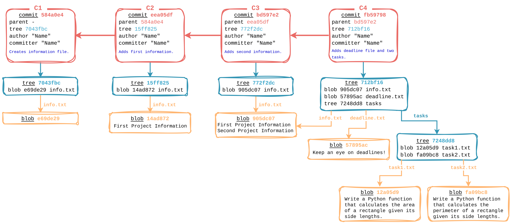
</p>

<br>

## Гранање

Гранање значи да се одвајате од главне линије развоја пројекта и да настављате рад без утицаја на ту главну линију. Начин на који програм Гит прави гране је невероватно једноставан за обраду, што чини да се операције гранања извршавају скоро тренутно, а скакање с једне на другу грану је углавном подједнако брзо.

Грана у програму Гит је просто један мали покретни показивач на неки од направљених комитова. Подразумевано име гране у Гиту је `master`. Када почнете да комитујете, даје вам се `master` грана која показује на последњи комит који сте направили. Сваки пут када комитујете, показивач `master` гране се аутоматски креће унапред.

С обзиром да грана може бити више у једном репозиторијуму, како Гит зна на којој грани се тренутно налазимо? - **Тако што чува посебан показивач који се зове `HEAD`**.

Као што већ знамо, у нашем репозиторијуму постоје четири комита у историји и једна грана (`master`) на коју тренутно показује `HEAD` показивач (коначно смо дошли то демистификације `HEAD -> master` исписа уз последњи комит):

```
$ git log --oneline
fb59798 (HEAD -> master) Adds deadline file and two tasks.
bd597e2 Adds second information.
eea05df Adds first information.
584a0e4 Creates information file.
```

<p align="center">
    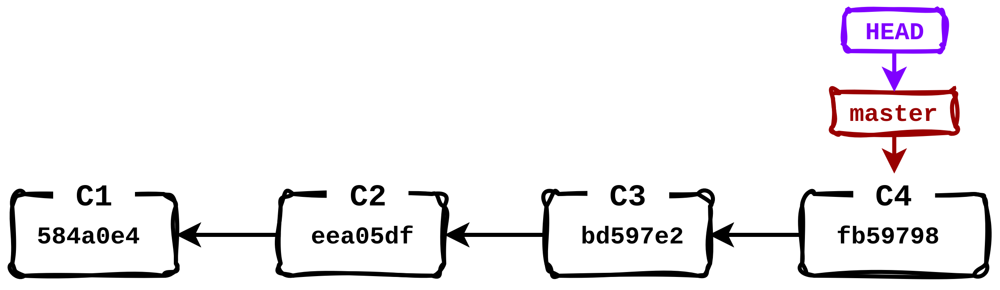
</p>


`master` грана у Гиту није посебна грана. Она је потпуно иста као и свака друга грана. Једини разлог због којег скоро сваки репозиторијум има такву грану је то што је наредба `git init` подразумевано направи, а већина људи нема потребу да је мења.

<br>

### Прављење нове гране

Шта се дешава када направите нову грану? Рецимо да направимо нову грану коју назовемо `sol` која ће бити намењена одвојеном раду на задацима `task1.txt` и `task2.txt`. За то користимо наредбу `git branch`:

```
$ git branch sol
```

Ово прави нову грану која показује на исти комит као и `master` грана:

```
$ git log --oneline
fb59798 (HEAD -> master, sol) Adds deadline file and two tasks.
bd597e2 Adds second information.
eea05df Adds first information.
584a0e4 Creates information file.
```

<p align="center">
    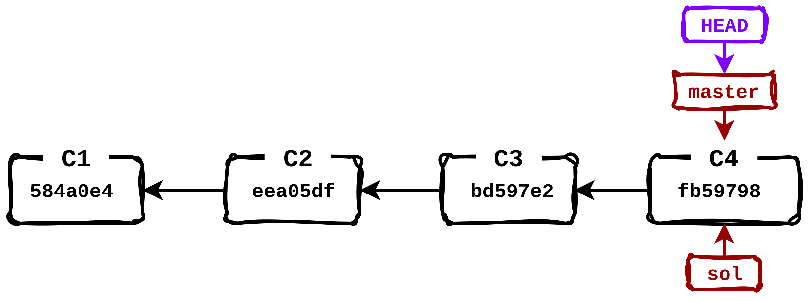
</p>

Испис грана које имамо у репозиторијуму се може направити просто позивом наредбе `git branch` без додатних аргумената:

```
$ git branch
* master
  sol
```

Зваздица испред назива гране означава да на ту грану показује `HEAD` показивач. У овом случају то је `master` грана што значи да се још налазимо на њој.

<br>

### Пребацивање између грана

Ако желимо `HEAD` показивач пребацити на грану `sol` (или краће: пребацити се на `sol` грану), користимо наредбу `git checkout` или `git switch`: 

```
$ git switch sol
или
$ git checkout sol
```

```
$ git branch
  master
* sol
```

У испису историје комитова видимо да показивач `HEAD` сада показује на `sol` грану:

```
$ git log --oneline
fb59798 (HEAD -> sol, master) Adds deadline file and two tasks.
bd597e2 Adds second information.
eea05df Adds first information.
584a0e4 Creates information file.
```

<p align="center">
    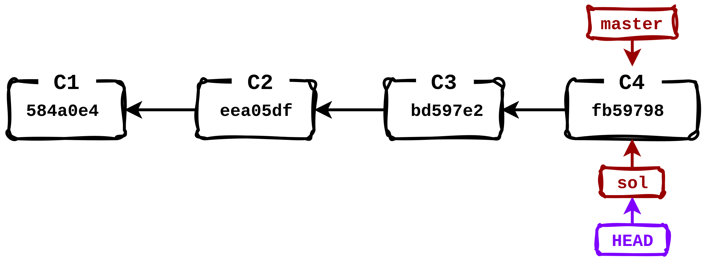
</p>


Могуће је једном нарадбом и направити грану и пребацити се на исту. То је `git checkout` наредба са опцијом `-b`. То значи да смо у овом случају уместо наредби `git branch sol` + `git switch sol` могли искористити само `git checkout -b sol`.

Хајде сада да решимо задатак чија поставка се налази у `tasks/task1.txt` датотеци. Најпре направимо празну датотеку `tasks/sol1.py`

```
$ touch tasks/sol1.py
```

У датотеку унети следећи код и сачувати:

```python
def area(a, b):
    area = a * b
    return area
```

Исписати статус репозиторијума и комитовати измене:

```
$ git status -s
?? tasks/sol1.py
```
```
$ git add tasks/sol1.py 
$ git commit -m "Adds solution for task 1."
```

У историји комитова видимо најновији комит на који показује грана `sol`, док је грана `master` остала да показује на претходни комит:

```
$ git log --oneline
112e875 (HEAD -> sol) Adds solution for task 1.
fb59798 (master) Adds deadline file and two tasks.
bd597e2 Adds second information.
eea05df Adds first information.
584a0e4 Creates information file.
```

<p align="center">
    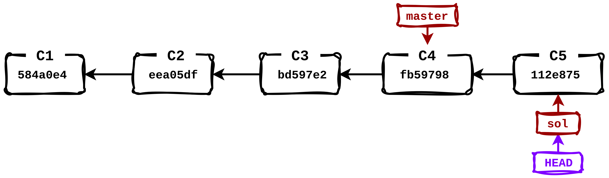
</p>

Ако сада хијерархијски излистамо садржај радног директоријума, добијамо следећи испис:

```
$ ls -R
.:
deadline.txt  info.txt  tasks

./tasks:
sol1.py  task1.txt  task2.txt
```

Као што очекујемо `sol1.py` датотека је у `tasks` директоријуму. Хајде сада да пређемо на `master` грану (ако са гране на којој се налазимо желимо прећи на грану на којој смо претходно били можемо користити и наредбу `git switch -`):

```
$ git switch master
или
$ git switch -
```

Поново излистамо садржај радног директоријума: 

```
$ ls -R
.:
deadline.txt  info.txt  tasks

./tasks:
task1.txt  task2.txt
```

Пошто `master` грана показује на претходни комит у који нису ушле измене којима се додаје решење првог задатка тј. датотека `tasks/sol1.py`, иста не постоји у радном директоријуму.

Показивач `HEAD` сада показује на `master`:

<p align="center">
    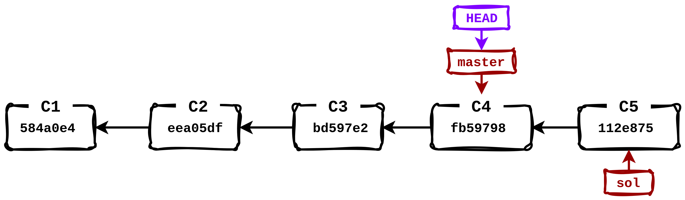
</p>

```
$ git log --oneline
fb59798 (HEAD -> master) Adds deadline file and two tasks.
bd597e2 Adds second information.
eea05df Adds first information.
584a0e4 Creates information file.
```

Међутим, приметимо да у претходном испису историје комитова не видимо последњи комит на који показује грана `sol`. Разлог је подразумевани формат исписа историје ако се вратимо на грану која показује на родитељски комит. Да бисмо ипак исписали и последњи, користићемо `-all` опцију уз `git log` наредбу:

```
$ git log --oneline --all
112e875 (sol) Adds solution for task 1.
fb59798 (HEAD -> master) Adds deadline file and two tasks.
bd597e2 Adds second information.
eea05df Adds first information.
584a0e4 Creates information file.
```

Рецимо да на `master` грани желимо решити други задатак. Поново најпре направимо `tasks/sol2.py` датотеку:

```
$ touch tasks/sol2.py
```

Затим у њу упишемо следећи код и сачувамо:

```python
def perimeter(a, b):
    return 2 * (a + b)
```

Сада је додамо у индекс и комитујемо:

```
$ git add tasks/sol2.py
```
```
$ git commit -m "Adds solution for task 2."
```

Након комитовања испис историје комитова је следећи:

```
$ git log --oneline --all
e4a1eff (HEAD -> master) Adds solution for task 2.
112e875 (sol) Adds solution for task 1.
fb59798 Adds deadline file and two tasks.
bd597e2 Adds second information.
eea05df Adds first information.
584a0e4 Creates information file.
```

Шести комит је ту али се из исписа стиче утисак да је комит `112e875` родитељски комит последњег комита, што није случај, већ је комит `fb59798` родитељски комит и комита `112e875` и `e4a1eff`. Да бисмо то и графички видели у испису историје комитова, користићемо опцију `--graph`:

```
$ git log --oneline --all --graph
* e4a1eff (HEAD -> master) Adds solution for task 2.
| * 112e875 (sol) Adds solution for task 1.
|/  
* fb59798 Adds deadline file and two tasks.
* bd597e2 Adds second information.
* eea05df Adds first information.
* 584a0e4 Creates information file.
```

<p align="center">
    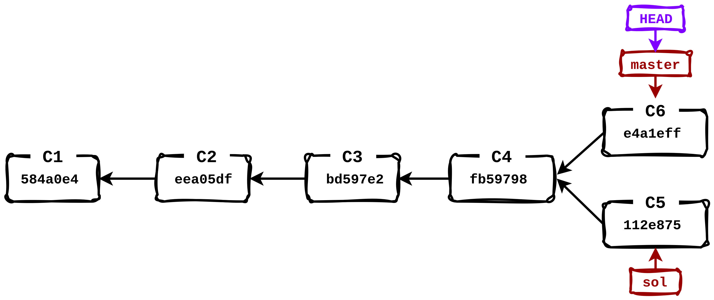
</p>

Сада излистамо садржај радног директоријума и као што и очекујемо, ту је `tasks/sol2.py` датотека:

```
$ ls -R
.:
deadline.txt  info.txt  tasks

./tasks:
sol2.py  task1.txt  task2.txt
```

<br>

### Спајање грана

Као што знамо, тренутно на `master` грани имамо решење другог, а на `sol` грани решење првог задатка. Сада их желимо спојити тако да у наставку развоја имамо доступна оба решења. За то ћемо користити наредбу `git merge` како бисмо спојили две гране (`master` и `sol`):

```
$ git merge sol -m "Merged branch sol."
```

Порука уз спајање је опциона али је згодно исписати јер се спајањем прави нови комит који ће носити ту поруку. Новонаправљени комит се назива комит спајања (*merge commit*) и посебан је једино у том смислу што има више од једног родитеља:

```
$ git log --oneline --all --graph
*   7776f45 (HEAD -> master) Merged branch sol.
|\  
| * 112e875 (sol) Adds solution for task 1.
* | e4a1eff Adds solution for task 2.
|/  
* fb59798 Adds deadline file and two tasks.
* bd597e2 Adds second information.
* eea05df Adds first information.
* 584a0e4 Creates information file.
```

<p align="center">
    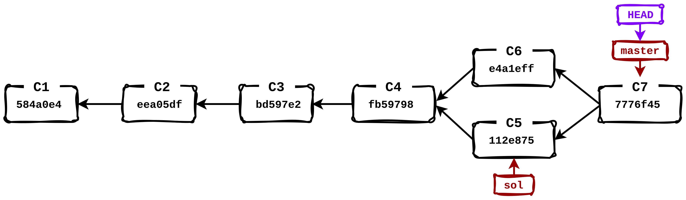
</p>

Ако пак сада излистамо садржај радног директоријума видећемо обе (`tasks/sol1.py` и `tasks/sol2.py`) датотеке са решењима:

```
$ ls -R
.:
deadline.txt  info.txt  tasks

./tasks:
sol1.py  sol2.py  task1.txt  task2.txt
```

<br>

### Брисање гране

Грана `sol` нам више није потребна па је можемо обрисати, а за брисање гране користимо опцију `-d` са `git branch` наредбом:

```
$ git branch -d sol
Deleted branch sol (was 112e875).
```
```
$ git branch
* master
```
```
$ git log --oneline --all --graph
*   7776f45 (HEAD -> master) Merged branch sol.
|\  
| * 112e875 Adds solution for task 1.
* | e4a1eff Adds solution for task 2.
|/  
* fb59798 Adds deadline file and two tasks.
* bd597e2 Adds second information.
* eea05df Adds first information.
* 584a0e4 Creates information file.
```

<p align="center">
    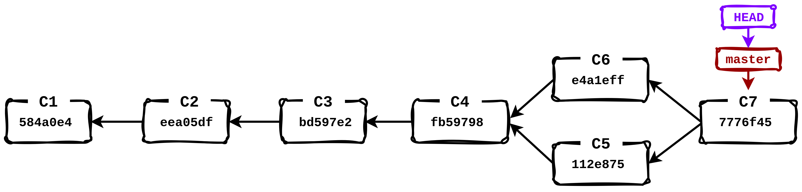
</p>

<br>

### Ребазирање грана

Следећи сценарио је тестирање за које је потребно да направимо грану `testing` и у истој додамо тест примере у обе датотеке са решењима (`tasks/sol1.py` и `tasks/sol2.py`). Најпре направимо грану и пређемо на исту:

```
$ git checkout -b testing
```

Проверимо испис свих грана и историју комитова:

```
$ git branch
  master
* testing
```

```
$ git log --oneline --all --graph
*   7776f45 (HEAD -> testing, master) Merged branch sol.
|\  
| * 112e875 Adds solution for task 1.
* | e4a1eff Adds solution for task 2.
|/  
* fb59798 Adds deadline file and two tasks.
* bd597e2 Adds second information.
* eea05df Adds first information.
* 584a0e4 Creates information file.
```

<p align="center">
    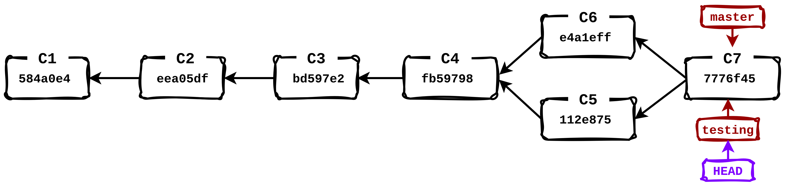
</p>

Изменимо сада `tasks/sol1.py` и `tasks/sol2.py` датотеке додавањем тест примера:

`tasks/sol1.py:`
```python
def area(a, b):
    area = a * b
    return area

a = 3
b = 4
print(f"Area for a={a} and b={b}: {area(a, b)}")
```

`tasks/sol2.py:`
```python
def perimeter(a, b):
    return 2 * (a + b)

a = 3
b = 4
print(f"Perimeter for a={a} and b={b}: {perimeter(a, b)}")
```

Комитујемо измене (приметити опцију `-а` за имплицитно додавање у индекс измена праћених датотека):

```
$ git commit -a -m "Write test cases for task solutions."
```

```
$ git log --oneline --all --graph
* 1790a0b (HEAD -> testing) Write test cases for task solutions.
*   7776f45 (master) Merged branch sol.
|\  
| * 112e875 Adds solution for task 1.
* | e4a1eff Adds solution for task 2.
|/  
* fb59798 Adds deadline file and two tasks.
* bd597e2 Adds second information.
* eea05df Adds first information.
* 584a0e4 Creates information file.
```

<p align="center">
    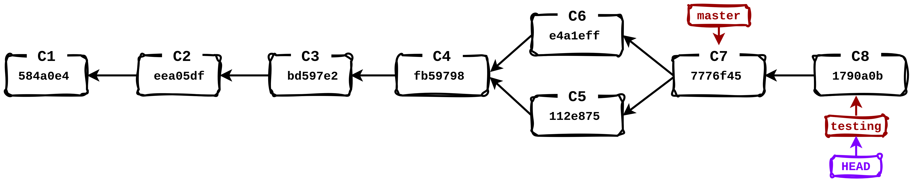
</p>

Рецимо да се сада неко на `master` грани одлучи да преуреди код решења `tasks/sol1.py`. Да бисмо то урадили, пређимо сада на `master` грану:

```
git switch master
```

<p align="center">
    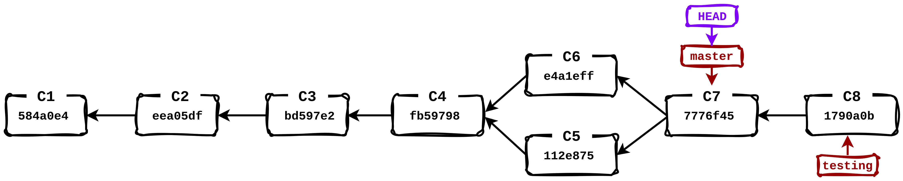
</p>

Ако сада завиримо у `tasks/sol1.py` и `tasks/sol2.py` датотеке, наравно не видимо тест примере јер су они додати радом на `testing` грани. Желимо преуредити код у `tasks/sol1.py` датотеци да изгледа овако:

```python
def area(a, b):
    return a * b
```

Након измена, разлика у односу на снимак из родитељског директоријума је следећа:

```diff
$ git diff
diff --git a/tasks/sol1.py b/tasks/sol1.py
index c0febcc..b257488 100644
--- a/tasks/sol1.py
+++ b/tasks/sol1.py
@@ -1,3 +1,2 @@
 def area(a, b):
-    area = a * b
-    return area
+    return a * b
```

Комитујемо измене:

```
$ git commit -a -m "Cleaned up the solution code for task 1."
```

Историја комитова сада изгледа некако овако:

```
$ git log --oneline --all --graph
* 612ada8 (HEAD -> master) Cleaned up the solution code for task 1.
| * 1790a0b (testing) Write test cases for task solutions.
|/  
*   7776f45 Merged branch sol.
|\  
| * 112e875 Adds solution for task 1.
* | e4a1eff Adds solution for task 2.
|/  
* fb59798 Adds deadline file and two tasks.
* bd597e2 Adds second information.
* eea05df Adds first information.
* 584a0e4 Creates information file.
```

<p align="center">
    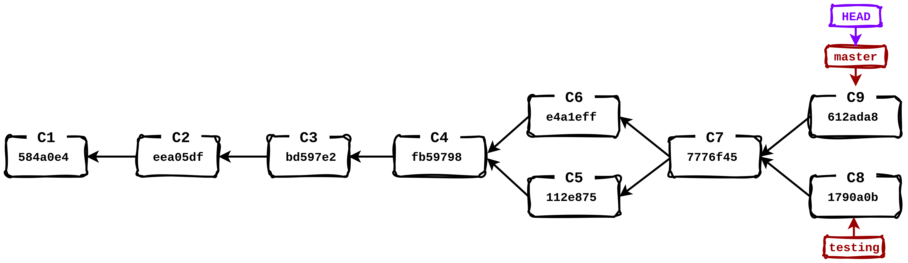
</p>

Вратимо се сада на `testing` грану како бисмо наставили тестирање:

```
git switch testing
```

<p align="center">
    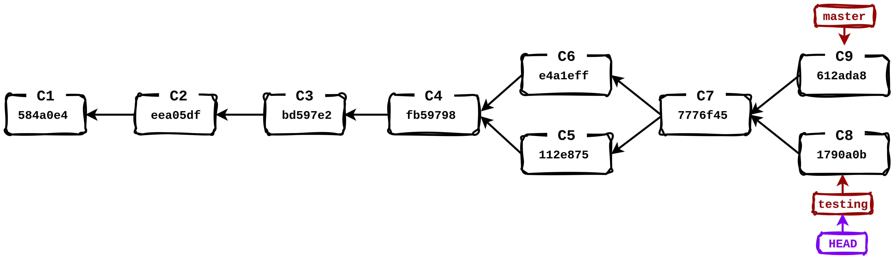
</p>

Наша решења можемо тестирати покретањем `python3` програма над сваком од датотека `tasks/sol1.py` и `tasks/sol2.py`:

```
$ python3 tasks/sol1.py 
Area for a=3 and b=4: 12

$ python3 tasks/sol2.py 
Perimeter for a=3 and b=4: 14
```

<br>

#### Испис разлика између више грана

Видимо да наше решење пролази тест примере и желимо се спојити са `master` граном. Међутим, шта ако је неко на главној `master` грани променио имплементацију решења (што и јесте био случај са $ git status -s
UU tasks/sol1.py
M  tasks/sol2.py
 решењем). Да бисмо видели разлике између стања на две гране користимо поново `git diff` наредбу:

```diff
$ git diff master testing
diff --git a/tasks/sol1.py b/tasks/sol1.py
index b257488..8e89063 100644
--- a/tasks/sol1.py
+++ b/tasks/sol1.py
@@ -1,2 +1,7 @@
 def area(a, b):
-    return a * b
+    area = a * b
+    return area
+
+a = 3
+b = 4
+print(f"Area for a={a} and b={b}: {area(a, b)}")
diff --git a/tasks/sol2.py b/tasks/sol2.py
index 24ca8aa..3d186df 100644
--- a/tasks/sol2.py
+++ b/tasks/sol2.py
@@ -1,2 +1,6 @@
 def perimeter(a, b):
     return 2 * (a + b)
+
+a = 3
+b = 4
+print(f"Perimeter for a={a} and b={b}: {perimeter(a, b)}")
```

<br>

#### Конфликти

Из претходног видимо испис разлика стања на `testing` грани у односу на `master` грану. Претпостављамо да су измене на `master` грани прихватљиве и желимо да се спојимо са њима. Већ смо видели резултат наредбе `merge` где се спајањем грана направи потпуно нови комит спајања. Међутим ако желимо да спајање грана "остави мањи траг" у историји, одрадићемо ребазирање (*rebase*) са `master` граном:

```
$ git rebase master
Auto-merging tasks/sol1.py
CONFLICT (content): Merge conflict in tasks/sol1.py
error: could not apply 1790a0b... Write test cases for task solutions.
hint: Resolve all conflicts manually, mark them as resolved with
hint: "git add/rm <conflicted_files>", then run "git rebase --continue".
hint: You can instead skip this commit: run "git rebase --skip".
hint: To abort and get back to the state before "git rebase", run "git rebase --abort".
hint: Disable this message with "git config set advice.mergeConflict false"
Could not apply 1790a0b... # Write test cases for task solutions.
```

Шта се сада десило? - Избио је конфликт при ребазирању (који такође може да се деси и при спајању). Разлог је тај што су у последње комитове на обе гране ушле измене истог дела једне датотеке, па самим тим Гит, иако је моћан, не може са сигурношћу да претпостави које измене желите да имате на главној линији развоја након ребазирања, да ли оне са `master` или `testing` гране. 

Овде је битно напоменути да ребазирање није прекинуто већ је у току, само чека наш сигнал шта да ради са конфликтним изменама. Такође, због ребазирања које је у току, не налазимо се ни на једној грани:

```
$ git branch
* (no branch, rebasing testing)
  master
  testing
```

Након избијања конфликта Гит нуди опцију прекида ребазирања и враћања на стање пре покретања наредбе `git rebase`, и то додавањем опције `--abort` тј. пуна наредба би гласила `git rebase --abort`. Међутим, ми желимо да разрешимо конфликт и наставимо ребазирање.

Испишимо сада статус репозиторијума:

```
$ git status -s
UU tasks/sol1.py
M  tasks/sol2.py
```

Испред имена датотеке за коју постоји конфликт је исписана ознака `UU` црвеном бојом. Потребно је ручно разрешити конфликт, а у ту сврху, након избијања конфликта, Гит је преуредио `tasks/sol1.py` датотеку на следећи начин:

```python
def area(a, b):
<<<<<<< HEAD
    return a * b
=======
    area = a * b
    return area

a = 3
b = 4
print(f"Area for a={a} and b={b}: {area(a, b)}")
>>>>>>> 1790a0b (Write test cases for task solutions.)
```

тако да можемо видети које измене долазе са које стране. Што се тиче конфликтних измена, преуредимо `tasks/sol1.py` датотеку тако да изгледа овако:

```python
def area(a, b):
    return a * b

a = 3
b = 4
print(f"Area for a={a} and b={b}: {area(a, b)}")
```

Што значи да смо прихватили измене кода са `master` гране, и додали тест пример са `testing` гране. 

Сада кад смо разрешили конфликт, обавестимо Гит о томе додавањем конфликтне датотеке у индекс:

```
$ git add tasks/sol1.py
```

А затим дамо наредбу за наставак ребазирања:

```
$ git rebase --continue
```

Овде нас Гит пита за поруку, а ако му је не проследимо задржаће поруку последњег комита са `testing` гране тј. гране са које смо покренули ребазирање.

Ребазирање је успешно завршено, а занимљиво је сада погледати историју комитова:

```
$ git log --oneline --all --graph
* 97011f7 (HEAD -> testing) Write test cases for task solutions.
* 612ada8 (master) Cleaned up the solution code for task 1.
*   7776f45 Merged branch sol.
|\  
| * 112e875 Adds solution for task 1.
* | e4a1eff Adds solution for task 2.
|/  
* fb59798 Adds deadline file and two tasks.
* bd597e2 Adds second information.
* eea05df Adds first information.
* 584a0e4 Creates information file.
```

Шта се десило са комитом `1790a0b` (`C8`) са слике? - Гит га је обрисао и заменио новим који је резултат спајања `C8` и `C9` комитова. На овај начин, (локално непотребни) подаци о гранању неће загађивати историју комитова. Илустративно, десило се следеће:

<p align="center">
    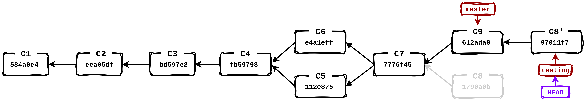
</p>

Ако сада желимо померити грану `master` да показује на исти комит као `testing`, урадићемо то коришћењем опције `-f` са наредбом `git branch`:

```
$ git branch -f master testing
```

Такође, можемо се и пребацити на `master` грану:

```
$ git switch master
```

```
$ git log --oneline --all --graph
* 97011f7 (HEAD -> master, testing) Write test cases for task solutions.
* 612ada8 Cleaned up the solution code for task 1.
*   7776f45 Merged branch sol.
|\  
| * 112e875 Adds solution for task 1.
* | e4a1eff Adds solution for task 2.
|/  
* fb59798 Adds deadline file and two tasks.
* bd597e2 Adds second information.
* eea05df Adds first information.
* 584a0e4 Creates information file.
```

<p align="center">
    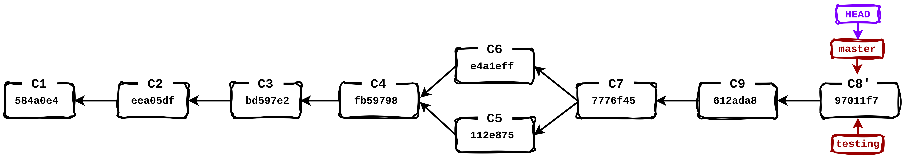
</p>

Ребазирање ћете често радити када желите се ваши комитови примене чисто на удаљену грану.

**Важно: Не ребазирајте комитове који постоје ван вашег репозиторијума и на којима су људи можда засновали свој рад.** Када нешто ребазирате, ви напуштате постојеће комитове и стварате нове који су им слични, али су ипак другачији. Ако комитове гурнете негде и остали их повуку, па базирају свој рад над њима, а ви затим поново напишете те комитове са `git rebase` и гурнете их поново, ваши сарадници ће морати да поново споје сав свој рад и онда ће настати хаос када пробате да повучете њихов рад назад у свој. 

<br>

## Рад са удаљеним репозиторијумима

Све што је претходно одрађено било је на локалу и ту смо се уверили у моћ Гита у верзионисању, али Гит нуди и широк спектар могућности за сарадњу на удаљеним Гит пројектима. Међутим, да бисте могли да сарађујете на било ком Гит пројекту, морате да научите како да организујете удаљене репозиторијуме (*remote repositories*, често само *remotes*). Удаљени репозиторијуми су верзије пројекта које су хостоване на Интернету или негде на мрежи. Можете их имати више, од којих вам је сваки у општем случају или доступан само за читање (*read-only*) или и за читање и за упис (*read/write*). Сарадња са другима подразумева управљање тим удаљеним репозиторијумима и слање (*push*) и повлачење (*pull*) података када је потребно поделити рад.

<br>

### Приказ удаљених репозиторијума

Сваки локални репозиторијим може имати један или више удаљених репозиторијума са којима је повезан. Наредба `git remote` приказује скраћена имена свих удаљених репозиторијума које смо повезали са нашим локалним репозиторијумом (и даље смо у нашем `dev_env` репозиторијуму):

```
$ git remote
```

Немамо никакав испис јер наш локални репозиторијум још увек није повезан ни са једним удаљеним сервером.

<br>

### Прављење GitHub репозиторијума

Идеја је да пошаљемо наш локални репозиторијум на неки удаљени одакле и други могу да му приступе. На почетку смо рекли да ћемо користити сервис [GitHub](#зашто-github) као хост за удаљене Гит репозиторијуме. Након што смо прошли кроз [основна подешавања](#ресурси-и-основна-подешавања), спремни смо да се повежемо са удаљеним репозиторијумом.

Најпре је потребно направити нови репозиторијум на вашем [GitHub](https://github.com/) налогу и да се зове идентично као наш локални репозиторијум (`dev_env`):

<p align="center">
    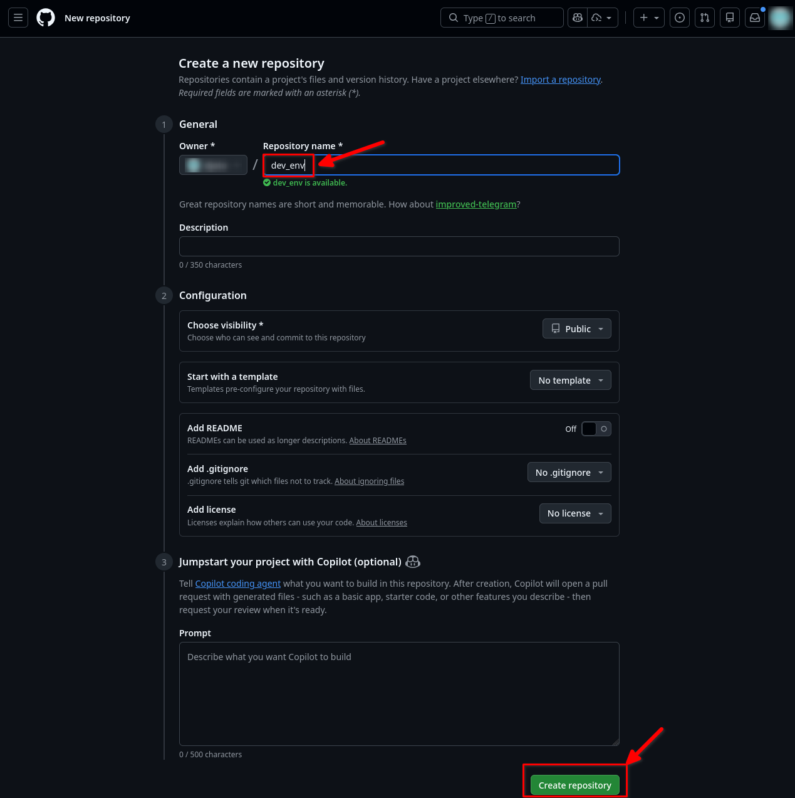
</p>

Након што се направи репозиторијум, приказује се почетна страница са упутством како повезати локални репозиторијум, а нас конкретно занима како повезати локални репозиторијум са удаљеним и на њега гурнути (*push*) садржај локалног репозиторијума:

<p align="center">
    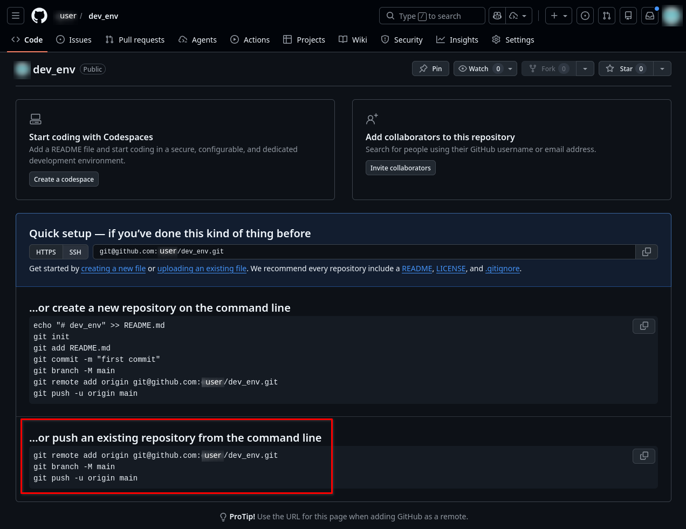
</p>

где је `user` ваше корисничко име са којим сте пријављени на GitHub-у.

<br>

### Додавање удаљених репозиторијума

Као што видимо из горњег упутства, најпре додамо удаљени репозиторијум:

```
$ git remote add origin git@github.com:user/dev_env.git
```

Тиме смо додали удаљени репозиторијум чији је [URL](https://en.wikipedia.org/wiki/URL): git@github.com:user/dev_env.git, а дали смо му скраћено име `origin`. Ако наредбом `git remote` излистамо повезане удаљене репозиторијуме, исписује баш то скраћено име:

```
$ git remote
origin
```

Коришћењем опције `-v` уз `git remote` наредбу, проширујемо испис и URL-ом повезаних репозиторијума:

```
$ git remote -v
origin  git@github.com:user/dev_env.git (fetch)
origin  git@github.com:user/dev_env.git (push)
```

Интерно, Гит за сваки *remote* памти два URL-a: један за преузимање (*fetch*), а други за слање (*push*), који се могу разликовати (нпр. преузимање преко HTTPS протокола *read-only*, a слање преко SSH протокола), али су подразумевано исти.

<br>

### Слање на удаљени репозиторијум

Пошто је подразумевана грана новонаправљеног удаљеног репозиторијума `main`, a не `master` (Зашто? - Нећете веровати, [зато!](https://sfconservancy.org/news/2020/jun/23/gitbranchname/)), потребно је да локалну грану `master` (на којој се сада налазимо) форсирано (опција `-M`) преименујемо у `main`:

```
$ git branch -M main
```
```
$ git branch
* main
  testing
```

Сада пошаљемо грану `main` на удаљени репозиторијум `origin`:

```
$ git push -u origin main
```

Опцијом `-u` смо за грану коју смо успешно послали додали и референцу за праћење како бисмо убудуће могли користити само `git push` (без неопходног навођења `origin main` дела).

Ако сада освежите GitHub страницу вашег репозиторијума, имате нешто налик на следеће:

<p align="center">
    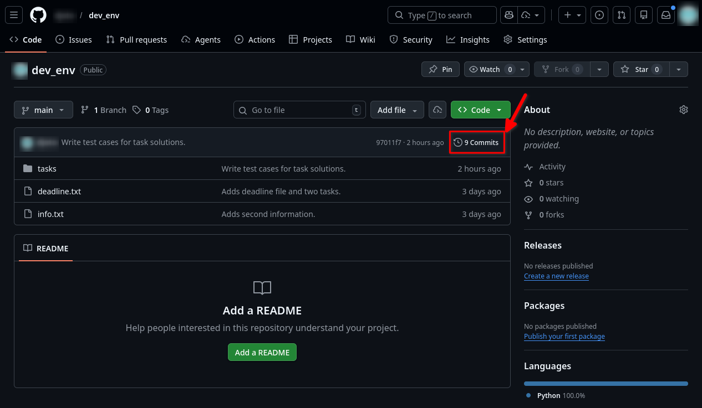
</p>

Тиме смо послали стање локалног репозиторијума на `main` грани на `main` грану удаљеног репозиторијума `origin`. Ако одете на стрелицом означен линк ка комитовима, добићете листу комитова са истим контролним сумама као што имамо на локалу: 

<p align="center">
    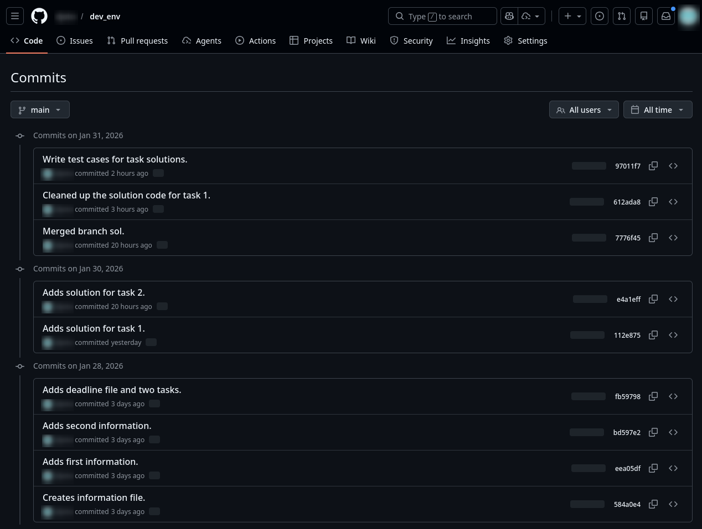
</p>

<br>

### Добављање и повлачење из удаљених репозиторијума

Ако сада погледамо историју комитова на локалу:

```
$ git log --oneline --all --graph
* 97011f7 (HEAD -> main, origin/main, testing) Write test cases for task solutions.
* 612ada8 Cleaned up the solution code for task 1.
*   7776f45 Merged branch sol.
|\  
| * 112e875 Adds solution for task 1.
* | e4a1eff Adds solution for task 2.
|/  
* fb59798 Adds deadline file and two tasks.
* bd597e2 Adds second information.
* eea05df Adds first information.
* 584a0e4 Creates information file.
```

уз `HEAD -> main` и `testing`, видимо и `origin/main` тзв. *remote-tracking* референцу која показује на удаљену грану `main` удаљеног репозиторијума (*remota*-a) `origin` тј. њено стање које нам је познато на локалу (а сада показује на исти комит као и локална `main` грана).

Meђутим, шта ако је неко ко има *write* приступ вашем удаљеном репозиторијуму сада направио неке измене (рецимо додао још једну информацију у `info.txt` датотеку) и послао измене на удаљени репозиторијум како би остали засновали рад на њима? Сложићете се да је неопходно да ми, који радимо на локалу, некако сазнамо за те измене и ажурирамо локални репозиторијум на исте.

Након што је сарадник послао своје измене на удаљени репозиторијум, на GitHub-у сада постоји још један комит, па листа комитова има следећи изглед:

<p align="center">
    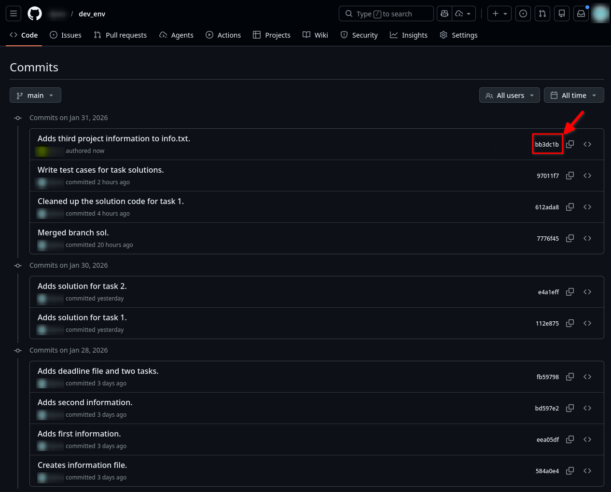
</p>

Да бисмо на локалу видели најновије стање удаљеног репозиторијума, добавићемо измене наредбом `git fetch <remote>`:

```
$ git fetch origin
```

Ако сада излистамо историју комитова видећемо следеће:

```
$ git log --oneline --all --graph
* bb3dc1b (origin/main, origin/HEAD) Adds third project information to info.txt.
* 97011f7 (HEAD -> main, testing) Write test cases for task solutions.
* 612ada8 Cleaned up the solution code for task 1.
*   7776f45 Merged branch sol.
|\  
| * 112e875 Adds solution for task 1.
* | e4a1eff Adds solution for task 2.
|/  
* fb59798 Adds deadline file and two tasks.
* bd597e2 Adds second information.
* eea05df Adds first information.
* 584a0e4 Creates information file.
```

Добављањем стања удаљеног репозиторијума смо освежили *remote-tracking* референцу `origin/main`.

Ако сада на локалу испишемо садржај датотеке `info.txt` видимо да трећа информација коју је додао сарадник не постоји код нас на локалу:

```
$ cat info.txt 
First Project Information
Second Project Information
```

То је и очекивано с обзиром да наш локални `HEAD` показивач показује накомит пре онога у коме је додата трећа информација. То значи да самим добављањем стања *remote*-a, нисмо локални репозиторијум ажурирали (спојили) на његово стање. Ако желимо да видимо које су то измене на удаљеном репозиторијуму које не постоје на локалном, користимо следећу наредбу:

```
$ git log --oneline main..origin/main
bb3dc1b (origin/main, origin/HEAD) Adds third project information to info.txt.
```

Излистан је комит `bb3dc1b` који смо и очекивали. А његове детаље проверимо са `git show` наредбом:

```diff
$ git show bb3dc1b 
commit bb3dc1bd42a5d7275cc9c0fc7a429b28d03f0608 (origin/main, origin/HEAD)
Author: "Collaborator's Name" <64656868+user@users.noreply.github.com>
Date:   Sat Jan 31 20:44:37 2026 +0100

    Adds third project information to info.txt.

diff --git a/info.txt b/info.txt
index 905dc07..88071f3 100644
--- a/info.txt
+++ b/info.txt
@@ -1,2 +1,3 @@
 First Project Information
 Second Project Information
+Third Project Information
```

Желимо исте измене да имамо и да локалу, па је потребно да се спојимо са изменама добављеним са удаљеног репозиторијума:

```
$ git merge origin/main 
Updating 97011f7..bb3dc1b
Fast-forward
 info.txt | 1 +
 1 file changed, 1 insertion(+)
```

```
$ git log --oneline --all --graph
* bb3dc1b (HEAD -> main, origin/main, origin/HEAD) Adds third project information to info.txt.
* 97011f7 (testing) Write test cases for task solutions.
* 612ada8 Cleaned up the solution code for task 1.
*   7776f45 Merged branch sol.
|\  
| * 112e875 Adds solution for task 1.
* | e4a1eff Adds solution for task 2.
|/  
* fb59798 Adds deadline file and two tasks.
* bd597e2 Adds second information.
* eea05df Adds first information.
* 584a0e4 Creates information file.
```

Сада видимо да смо на локалу усклађени са стањем удаљеног репозиторијума које нам је познато: 

```
$ cat info.txt 
First Project Information
Second Project Information
Third Project Information
```

Такође, уместо добављања измена (*fetch*) и после тога спајања (*merge*) могуће је користити само једну наредбу која их обједињује, а то је `git pull` којом **повлачимо** удаљени репозиторијум директно у локални:

Пошто сада нема разлике између локалног и удаљеног репозиторијума, добићемо обавјештење да је све ажурирано након `git pull` наредбе:

```
$ git pull
Already up to date.
```

Ако се сада питате зашто није неопходно навести `git pull origin main` како бисмо дефинисали одакле повлачимо измене, одговор је у томе да смо локалну грану `main` трајно повезали са удаљеном `main` граном тј. подесили смо тзв. *upstream*,  а то смо урадили још при првом слању локалног репозиторијума опцијом `-u` уз наредбу `git push`. Информације о подешеном *upstream*-у можемо видети наредбом:

```
$ git branch -vv
* main    bb3dc1b [origin/main] Adds third project information to info.txt.
  testing 97011f7 Write test cases for task solutions.
```

<br>

### Скривање

Ако већ наредба `git pull` директно ажурира стање нашег локалног радног директоријума на ново стање удаљеног репозиторијума, логично је запитати се шта ће се десити ако већ имамо неке измене у локалном радном директоријуму које нису комитоване, а на удаљеном репозиторијуму постоје измене у истој датотеци које треба повући. Рецимо да је сарадник додао први рок у `deadline.txt` датотеку и послао измене на удаљени репозиторијум:

<p align="center">
    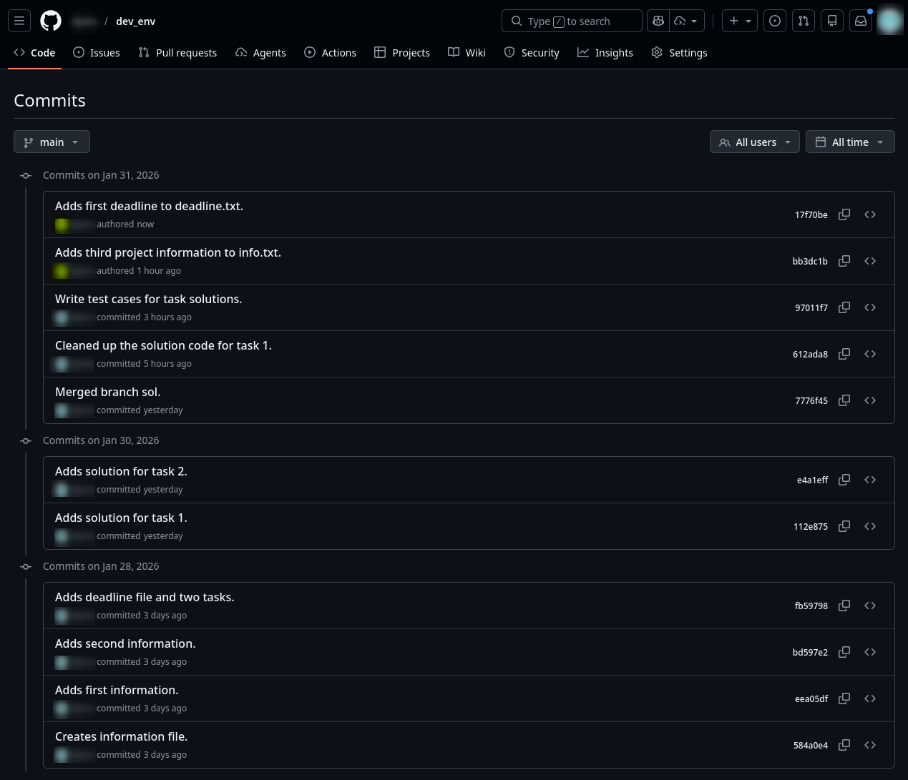
</p>

Независно, ми ћемо на локалу такође додати први рок и још једну информацију у датотеку `info.txt`, a измене `info.txt` датотеке ћемо додати и у индекс:

```
$ echo "First deadline: 01.03.2026" >> deadline.txt 
$ echo "Fourth Project Information" >> info.txt 

$ cat deadline.txt 
Keep an eye on deadlines!
First deadline: 01.03.2026.

$ cat info.txt 
First Project Information
Second Project Information
Third Project Information
Fourth Project Information
```
```
$ git add info.txt 
```
```
$ git status -s
 M deadline.txt
M  info.txt
```

Ако сада повучемо удаљени репозиторијум, операција ће се прекинути јер су препознате измене исте датотеке и на локалном и на удаљеном репозиторијуму:

```
$ git pull
...
Updating bb3dc1b..17f70be
error: Your local changes to the following files would be overwritten by merge:
        deadline.txt
Please commit your changes or stash them before you merge.
Aborting
```

Као што нас испис и упућује, једна опција је да комитујемо локалне измене и затим спојимо са удаљени репозиторијумом. То можете испробати као необавезан домаћи задатак, а ми ћемо се овде позабавити другом опцијом, с којом се до сада нисмо сусрели. Наиме, о чему се ради? - У питању је опција скривања (*stash*) измена које се прате или које су додате у индекс:

```
$ git status -s
 M deadline.txt
M  info.txt
```
```
$ git stash
Saved working directory and index state WIP on main: bb3dc1b Adds third project information to info.txt.
```
```
$ git status -s
```

Ова наредба суштински функционише као стек у који можемо паковати измене које Гит прати или које су додате у индекс како бисмо радни директоријум привремено очистили за неке друге измене. Ако желимо да вратимо измене са стека, користимо наредбу:

```
$ git stash pop
```
```
$ git status -s
 M deadline.txt
 M info.txt
```

Међутим, како нам ово може помоћи ако желимо повући удељени репозиторијум? - Тако што привремено сакријемо тренутне радне измене (које после лако можемо да вратимо), а `git pull` наредба неће наићи на препреку у виду било каквих локалних измена:

```
$ git stash
```
```
$ git pull
Updating bb3dc1b..17f70be
Fast-forward
 deadline.txt | 1 +
 1 file changed, 1 insertion(+)
```

Ако погледамо садржај `deadline.txt` датотеке, видимо да је додат први рок:

```
$ cat deadline.txt 
Keep an eye on deadlines!
First deadline: 01.02.2026
```

Хајде сада да покушамо вратити са стека наше измене:

```
$ git stash pop
Auto-merging deadline.txt
CONFLICT (content): Merge conflict in deadline.txt
On branch main
Your branch is up to date with 'origin/main'.

Changes to be committed:
  (use "git restore --staged <file>..." to unstage)
        modified:   info.txt

Unmerged paths:
  (use "git restore --staged <file>..." to unstage)
  (use "git add <file>..." to mark resolution)
        both modified:   deadline.txt

The stash entry is kept in case you need it again.
```
```
$ git status -s
UU deadline.txt
M  info.txt
```

Као што смо и очекивали, долази до конфликта јер смо локално претходно додали први рок у `deadline.txt` датотеку, а то је исто урађено и на удаљеном репозиторијуму (али се рокови не поклапају). Треба да отворимо `deadline.txt` датотеку и ручно разрешимо конфликт. Њен садржај је сада следећи:

```
Keep an eye on deadlines!
<<<<<<< Updated upstream
First deadline: 01.02.2026
=======
First deadline: 01.03.2026
>>>>>>> Stashed changes
```

Овде јасно пише које измене долазе одакле, а ми се овде одлучујемо да оствимо први рок са удаљеног репозиторијума, а наш додамо као други, тако да ће датотека сада имати следећи садржај:

```
Keep an eye on deadlines!
First deadline: 01.02.2026
Second deadline: 01.03.2026
```

Након тога, измене додамо у индекс чиме означимо да је конфликт разрешен, а затим комитујемо:

```
$ git add deadline.txt 
```

```
$ git status -s
M  deadline.txt
M  info.txt
```
```
$ git commit -m "Adds second deadline and new information."
```

Ако су још увек имамо скривене измене на стеку (што се може десити јер смо имали конфликт), потребно је да их обришемо. Најпре излистамо стек скривених измена:

```
$ git stash list
stash@{0}: WIP on main: bb3dc1b Adds third project information to info.txt.
```

А затим и обришемо:

```
$ git stash clear
```

Историја комитова сада има следећи изглед:

```
$ git log --oneline --all --graph
* 1f65c69 (HEAD -> main) Adds second deadline and new information.
* 17f70be (origin/main, origin/HEAD) Adds first deadline to deadline.txt.
* bb3dc1b Adds third project information to info.txt.
* 97011f7 (testing) Write test cases for task solutions.
* 612ada8 Cleaned up the solution code for task 1.
*   7776f45 Merged branch sol.
|\  
| * 112e875 Adds solution for task 1.
* | e4a1eff Adds solution for task 2.
|/  
* fb59798 Adds deadline file and two tasks.
* bd597e2 Adds second information.
* eea05df Adds first information.
* 584a0e4 Creates information file.
```

Сада је потребно да локално стање пошаљено на удаљени репозиторијум. **Пре тога је препоручљиво повући још једном удаљени репозиторијум у случају да је на њему у међувремену дошло до нових измена:**

```
$ git pull
Already up to date.
```

Ово значи да на удаљеном репозиторијуму не постоје измене које већ не поседујемо на локалу и да је безбедно да пошаљемо ново стање локалног репозиторијума на удаљени:

```
$ git push
Enumerating objects: 7, done.
Counting objects: 100% (7/7), done.
Delta compression using up to 14 threads
Compressing objects: 100% (4/4), done.
Writing objects: 100% (4/4), 427 bytes | 427.00 KiB/s, done.
Total 4 (delta 1), reused 0 (delta 0), pack-reused 0 (from 0)
remote: Resolving deltas: 100% (1/1), completed with 1 local object.
To github.com:user/dev_env.git
   17f70be..1f65c69  main -> main
```

Ако на GitHub-у сада освежимо страницу са историјом комитова, видимо нови комит направљен претходно на локалу:

<p align="center">
    
</p>

<br>

### Клонирање удаљеног репозиторијума

Ако желите да преузмете копију постојећег Гит репозиторијума — на пример, пројекта којем бисте желели дате свој допринос, наредба која вам је потребна је `git clone`. Наредба `git clone` је у суштини нешто као омотач око неколико других наредби. Она прави нови директоријум, улази у њега и извршава `git init` којом прави празан Гит репозиторијум, додаје удаљени репозиторијум (`git remote add`) са URL адресе коју јој проследите (подразумевано под именом `origin`), извршава `git fetch` са тог удаљеног репозиторијума и онда одјављује најновији комит у ваш радни директоријум наредбом `git checkout`. 

Рецимо да у `HOME` директоријуму имамо поддиректоријум `projects` у који желимо клонирати наш удаљени `dev_env` репозиторијум чији је URL `git@github.com:user/dev_env.git`:

```
$ cd ~/projects
$ git clone git@github.com:user/dev_env.git
$ cd dev_env
```
```
$ git log --oneline --all --graph
* 1f65c69 (HEAD -> main, origin/main, origin/HEAD) Adds second deadline and new information.
* 17f70be Adds first deadline to deadline.txt.
* bb3dc1b Adds third project information to info.txt.
* 97011f7 Write test cases for task solutions.
* 612ada8 Cleaned up the solution code for task 1.
*   7776f45 Merged branch sol.
|\  
| * 112e875 Adds solution for task 1.
* | e4a1eff Adds solution for task 2.
|/  
* fb59798 Adds deadline file and two tasks.
* bd597e2 Adds second information.
* eea05df Adds first information.
* 584a0e4 Creates information file.
```
```
$ git branch
* main
```

<br>

## Гит алијаси

Постоји још једна мала ствар која ће учинити да ваше искуство у раду са Гитом буде једноставније и лакше: **алијаси**. Aко наставите да користите Гит иоле редовно, алијаси су нешто што би требало да познајете. Ако не желите да сваки пут куцате комплетан текст неке Гит наредбе кад вам затреба, можете лако да подесите алијас за сваку наредбу (а и њене опције) помоћу `git config`. Употребом `--global` опције учинићете да алијаси буду доступни у сваком Гит репозиторијуму на систему а не само у тренутном репозиторијуму. Подешавање алијаса поготово има смисла ако је текст наредбе дугачак и та наредба се често користи. Рецимо у овом упутству смо често за испис историје комитова користили следећу наредбу:

```
$ git log --oneline --all --graph
```

Сада желимо да подесимо алијас за исту тако да је можемо позвати наредбом `git hist`:

```
$ git config --global alias.hist 'log --oneline --all --graph'
```
```
$ git hist
* 1f65c69 (HEAD -> main, origin/main, origin/HEAD) Adds second deadline and new information.
* 17f70be Adds first deadline to deadline.txt.
* bb3dc1b Adds third project information to info.txt.
* 97011f7 Write test cases for task solutions.
* 612ada8 Cleaned up the solution code for task 1.
*   7776f45 Merged branch sol.
|\  
| * 112e875 Adds solution for task 1.
* | e4a1eff Adds solution for task 2.
|/  
* fb59798 Adds deadline file and two tasks.
* bd597e2 Adds second information.
* eea05df Adds first information.
* 584a0e4 Creates information file.
```

Листу алијаса подешених на глобалном нивоу можете видети наредбом:

```
$ git config --global --list | grep alias
```

А за уклањање алијаса који смо подесили користимо следећу наредбу:

```
$ git config --global --unset alias.hist
```

<br>

## Игнорисање датотека

Често ћете имати неку групу датотека коју не желите да Гит аутоматски додаје, па чак ни да вам их приказује као непраћене. То је обично аутоматски генерисани садржај као што су логови или датотеке које генерише ваш систем за изградњу (*build*). Да би одређена група датотека (или тачно одређена датотека) у радном директоријуму била игнорисана од стране Гита, потребно је њено име, или образац (шаблон) у који се њено име уклапа, додати у специјалну `.gitignore` датотеку која треба да се налази у директоријуму у којем је и иницијализаован Гит репозиторијум. Датотеку `.gitignore` Гит прочита и ако у радном директоријуму пронађе неку датотеку која се уклапа у образац или име дефинисано у `.gitignore`, он је потпуно игнорише, тј. нити је додаје у индекс нити је означава као непраћену.

Рецимо ако је садржај `.gitignore` датотеке следећи:

```
$ cat .gitignore
todo.txt
*.[oa]
*.lib
```

игнорисаће се `todo.txt` датотека, све датотеке које се завршавају на `.o` или `.a`, као и све датотеке које се завршавају на `.lib`. Битно је напоменути да ће се датотеке које се уклопе у обрасце игнорисати рекурзивно у свим поддиректоријумима.  

Правила за шаблоне које можете ставити у `.gitignore` су следећа:
* Линије које почињу са `#` се третирају као коментари и Гит их не чита.
* Шаблони се примењују рекурзивно у свим поддиректоријумима.
* Обрасци треба да почну са `/` ако желите да избегнете рекурзију.
* Обрасци треба да се заврше са `/` ако наводите директоријум.
* Образац се може и негирати тако што ће почети знаком узвика `!`.

Следи један пример `.gitignore` датотеке који преузет из [ProGit](https://git-scm.com/book/en/v2) књиге наведе у [референцама](#основни-материјали-и-референце-за-учење):

```
# игнориши све .a датотеке
*.a

# али прати lib.a, иако се изнад игноришу све .a датотеке
!lib.a

# игнориши само TODO датотеке у текућем директоријуму, али не и рекурзивно (у поддир/TODO)
/TODO

# игнориши све датотеке у build/ директоријуму
build/

# игнориши све .pdf датотеке у doc/ директоријуму (и његовим поддиректоријумима)
doc/**/*.pdf
```

Ако вам је потребна добра почетна тачка за ваш пројекат, GitHub одржава прилично свеобухватну листу добрих `.gitignore` примера датотека прилагођених за прегршт пројеката и језика на https://github.com/github/gitignore.